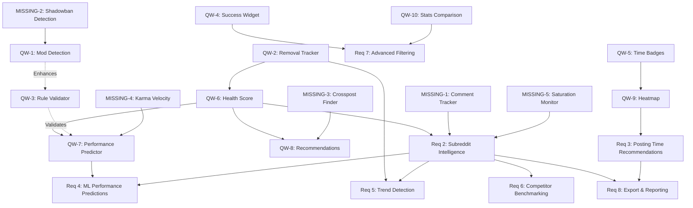

---------# Requirements Document

## Introduction

This specification defines an advanced Reddit analytics system for ThottoPilot that provides content creators with actionable insights, predictive intelligence, and competitive analysis. The system builds upon the existing analytics foundation to deliver Pro and Premium tier features including subreddit discovery intelligence, optimal posting time recommendations, content performance predictions, and competitor benchmarking.

## Implementation Complexity & Time Estimates

### Core Analytics Requirements

| Requirement | Manual Dev | AI-Assisted | Difficulty | Cost |
|-------------|-----------|-------------|------------|------|
| **Req 1**: Enhanced Dashboard | 0h (done) | 0h (done) | ✅ Trivial | $0 |
| **Req 2**: Subreddit Intelligence | 12-16h | 6-8h | 🟡 Medium | $0 |
| **Req 3**: Posting Time Recommendations | 12-16h | 6-8h | 🟡 Medium | $0 |
| **Req 4**: Performance Predictions | 24-32h | 12-16h | 🔴 Hard | $0 (local GPU) |
| **Req 5**: Trend Detection & Alerts | 18-24h | 10-12h | 🟠 Medium-Hard | $0 |
| **Req 6**: Competitor Benchmarking | 28-36h | 14-18h | 🔴 Hard | $0 |
| **Req 7**: Advanced Filtering | 4-6h | 2-3h | 🟢 Easy | $0 |
| **Req 8**: Export & Reporting | 6-8h | 3-4h | 🟢 Easy | $0 |
| **Req 9**: Real-time Updates | 0h (done) | 0h (done) | ✅ Trivial | $0 |
| **Req 10**: Mobile Optimization | 10-14h | 5-7h | 🟡 Medium | $0 |

**Total Core Requirements**: 114-152h manual → 58-76h AI-assisted (50% time savings)

### GPU-Accelerated ML Enhancement Features

These optional features leverage your RTX 4090 for advanced machine learning capabilities:

| Feature | Manual Dev | AI-Assisted | GPU Benefit | Monthly Cost |
|---------|-----------|-------------|-------------|--------------|
| **ML-1**: Image Content Analysis | 32-40h | 16-20h | 🚀 10x faster inference | $0 (local) vs $50-150 (cloud) |
| **ML-2**: NSFW Content Classification | 24-32h | 12-16h | 🚀 Real-time processing | $0 (local) vs $30-80 (cloud) |
| **ML-3**: Caption Quality Scoring | 20-28h | 10-14h | 🚀 Batch processing | $0 (local) vs $20-60 (cloud) |
| **ML-4**: Viral Content Prediction | 36-48h | 18-24h | 🚀 Complex model training | $0 (local) vs $100-300 (cloud) |
| **ML-5**: Automated A/B Testing | 28-36h | 14-18h | 🚀 Multi-variant analysis | $0 (local) vs $40-120 (cloud) |

**Total ML Features**: 140-184h manual → 70-92h AI-assisted + **$240-710/month cloud cost savings**

### Quick Win Features (Weekend Projects)

These features provide immediate value with minimal implementation time:

| Feature | Manual Dev | AI-Assisted | Value | Cost |
|---------|-----------|-------------|-------|------|
| **QW-1**: Mod Detection & Safe Posting | 4-6h | 2-3h | 🔥 High | $0 |
| **QW-2**: Post Removal Tracker | 3-4h | 1.5-2h | 🔥 High | $0 |
| **QW-3**: Enhanced Rule Validator | 5-7h | 2.5-3.5h | 🔥 High | $0 |
| **QW-4**: Success Rate Dashboard Widget | 2-3h | 1-1.5h | 🔥 Medium | $0 |
| **QW-5**: Best Time Badge System | 3-4h | 1.5-2h | 🔥 Medium | $0 |
| **QW-6**: Subreddit Health Score | 3-5h | 1.5-2.5h | 🔥 Very High | $0 |
| **QW-7**: Post Performance Predictor | 4-6h | 2-3h | 🔥 Very High | $0 |
| **QW-8**: Smart Subreddit Recommendations | 5-7h | 2.5-3.5h | 🔥 Very High | $0 |
| **QW-9**: Engagement Heatmap | 3-4h | 1.5-2h | 🔥 High | $0 |
| **QW-10**: Quick Stats Comparison | 2-3h | 1-1.5h | 🔥 High | $0 |

**Total Quick Wins**: 36-49h manual → 18-24.5h AI-assisted (complete all 10 in 2-3 weekends!)

---

## User Impact Rankings & Priority Matrix

### Quick Wins - Ranked by Impact

| Rank | Feature | Impact Score | Reasoning | Build Priority |
|------|---------|--------------|-----------|----------------|
| 🥇 1 | **QW-6**: Subreddit Health Score | ⭐⭐⭐⭐⭐ 95/100 | Single metric answers "where should I post?" - drives all decisions | **CRITICAL** |
| 🥈 2 | **QW-7**: Performance Predictor | ⭐⭐⭐⭐⭐ 92/100 | Prevents wasted posts, builds confidence, immediate ROI | **CRITICAL** |
| 🥉 3 | **QW-2**: Post Removal Tracker | ⭐⭐⭐⭐⭐ 90/100 | Learns from failures, prevents repeat mistakes, data foundation | **CRITICAL** |
| 4 | **QW-8**: Subreddit Recommendations | ⭐⭐⭐⭐ 85/100 | Growth engine, discovers new audiences, competitive advantage | **HIGH** |
| 5 | **QW-1**: Mod Detection | ⭐⭐⭐⭐ 82/100 | Prevents removals proactively, reduces frustration | **HIGH** |
| 6 | **QW-3**: Enhanced Rule Validator | ⭐⭐⭐⭐ 80/100 | Catches mistakes before posting, personalized warnings | **HIGH** |
| 7 | **QW-9**: Engagement Heatmap | ⭐⭐⭐ 75/100 | Visual insight, easy to understand, actionable | **MEDIUM** |
| 8 | **QW-4**: Success Rate Widget | ⭐⭐⭐ 72/100 | Motivational, tracks progress, simple metric | **MEDIUM** |
| 9 | **QW-10**: Stats Comparison | ⭐⭐⭐ 70/100 | Shows improvement over time, validates strategy changes | **MEDIUM** |
| 10 | **QW-5**: Time Badge System | ⭐⭐ 65/100 | Nice-to-have, duplicates heatmap functionality | **LOW** |

### Core Requirements - Ranked by Impact

| Rank | Feature | Impact Score | Reasoning | Dependencies |
|------|---------|--------------|-----------|--------------|
| 🥇 1 | **Req 2**: Subreddit Intelligence | ⭐⭐⭐⭐⭐ 94/100 | Deep insights per subreddit, trend analysis, performance breakdown | QW-6, QW-2 |
| 🥈 2 | **Req 3**: Posting Time Recommendations | ⭐⭐⭐⭐⭐ 90/100 | Maximizes engagement, data-driven scheduling, timezone aware | QW-9 |
| 🥉 3 | **Req 5**: Trend Detection & Alerts | ⭐⭐⭐⭐ 88/100 | Proactive notifications, catches problems early, retention driver | Req 2 |
| 4 | **Req 7**: Advanced Filtering | ⭐⭐⭐⭐ 82/100 | Power user feature, enables deep analysis, flexible queries | Req 1 |
| 5 | **Req 4**: Performance Predictions (ML) | ⭐⭐⭐⭐ 80/100 | Premium differentiator, sophisticated predictions, requires training | QW-7, Req 2 |
| 6 | **Req 8**: Export & Reporting | ⭐⭐⭐ 75/100 | Professional feature, enables external analysis, compliance | Req 1, Req 2 |
| 7 | **Req 6**: Competitor Benchmarking | ⭐⭐⭐ 72/100 | Premium feature, privacy concerns, complex implementation | Req 2 |
| 8 | **Req 10**: Mobile Optimization | ⭐⭐⭐ 70/100 | Accessibility, modern UX, responsive design | Req 1 |

### ML Features - Ranked by Impact

| Rank | Feature | Impact Score | Reasoning | GPU Benefit |
|------|---------|--------------|-----------|-------------|
| 🥇 1 | **ML-2**: NSFW Classification | ⭐⭐⭐⭐⭐ 96/100 | **CRITICAL** - Prevents bans, ensures compliance, legal protection | Real-time |
| 🥈 2 | **ML-4**: Viral Content Prediction | ⭐⭐⭐⭐ 85/100 | Revenue driver, premium feature, competitive moat | Training |
| 🥉 3 | **ML-1**: Image Content Analysis | ⭐⭐⭐⭐ 82/100 | Insights into what works, content optimization, unique feature | Inference |
| 4 | **ML-3**: Caption Quality Scoring | ⭐⭐⭐ 78/100 | Improves captions, complements existing AI generation | Batch |
| 5 | **ML-5**: Automated A/B Testing | ⭐⭐⭐ 75/100 | Advanced feature, requires significant data, complex UX | Multi-variant |

---

## Missing Critical Features Analysis

### Identified Gaps in Current Spec

#### **MISSING-1: Comment Engagement Tracker** 🔴 CRITICAL
**Impact:** ⭐⭐⭐⭐⭐ 93/100  
**Time:** 3-4h AI-assisted  
**Why Missing:** Reddit success isn't just upvotes - comments drive community engagement and algorithm visibility

**What it does:**
- Tracks comment count, sentiment, and response time on user's posts
- Identifies posts that spark conversation vs silent upvotes
- Alerts when comments need responses (engagement opportunity)
- Shows comment-to-upvote ratio (quality metric)

**Implementation:**
```sql
ALTER TABLE reddit_post_outcomes ADD COLUMN comment_count INTEGER DEFAULT 0;
ALTER TABLE reddit_post_outcomes ADD COLUMN avg_comment_length INTEGER;
ALTER TABLE reddit_post_outcomes ADD COLUMN user_replied BOOLEAN DEFAULT FALSE;
```

---

#### **MISSING-2: Shadowban & Spam Filter Detection** 🔴 CRITICAL
**Impact:** ⭐⭐⭐⭐⭐ 98/100  
**Time:** 4-5h AI-assisted  
**Why Missing:** Users waste time posting to subreddits where they're shadowbanned or spam-filtered

**What it does:**
- Detects when posts get 0 engagement despite good timing/content
- Checks if post is visible to others (via Reddit API)
- Alerts user to potential shadowban or spam filter
- Recommends actions (contact mods, verify email, build karma)

**Implementation:**
```typescript
// Check if post is visible
async function detectShadowban(postId: string): Promise<boolean> {
  const post = await reddit.getSubmission(postId);
  const isRemoved = post.removed || post.spam;
  const hasZeroEngagement = post.score === 1 && post.num_comments === 0;
  const isOlderThan1Hour = Date.now() - post.created_utc * 1000 > 3600000;
  
  return isRemoved || (hasZeroEngagement && isOlderThan1Hour);
}
```

---

#### **MISSING-3: Crosspost Opportunity Finder** 🟡 HIGH VALUE
**Impact:** ⭐⭐⭐⭐ 87/100  
**Time:** 5-6h AI-assisted  
**Why Missing:** Users manually search for crosspost opportunities - automation saves time and increases reach

**What it does:**
- Identifies successful posts that could be crossposted to related subreddits
- Suggests optimal crosspost timing (not immediate to avoid spam detection)
- Tracks crosspost performance vs original
- Recommends title variations for different audiences

**Implementation:**
```typescript
interface CrosspostOpportunity {
  originalPost: Post;
  targetSubreddits: string[];
  suggestedTiming: Date; // 6-24 hours after original
  titleVariations: string[];
  estimatedReach: number;
}
```

---

#### **MISSING-4: Karma Velocity Tracker** 🟡 HIGH VALUE
**Impact:** ⭐⭐⭐⭐ 84/100  
**Time:** 2-3h AI-assisted  
**Why Missing:** Early karma velocity predicts final post performance - enables real-time optimization

**What it does:**
- Tracks upvotes in first 15min, 1hr, 3hr, 6hr, 24hr
- Compares to historical velocity curves
- Predicts final upvote count based on early velocity
- Alerts if post is underperforming (consider deleting/reposting)

**Implementation:**
```sql
CREATE TABLE post_velocity_snapshots (
  id SERIAL PRIMARY KEY,
  post_id INTEGER REFERENCES reddit_post_outcomes(id),
  snapshot_at INTERVAL, -- '15 minutes', '1 hour', etc.
  upvotes INTEGER,
  comments INTEGER,
  velocity_score FLOAT, -- upvotes per hour
  created_at TIMESTAMP DEFAULT NOW()
);
```

---

#### **MISSING-0: Subreddit Library Auto-Sync** � FHOUNDATIONAL
**Impact:** ⭐⭐⭐⭐⭐ 99/100  
**Time:** 4-6h AI-assisted  
**Why Missing:** Users need their posting history synced to populate analytics - this is the data foundation for everything

**What it does:**
- **Quick Sync (automatic):** Fetch last 100 posts, extract top 10 subreddits (~30 seconds)
- **Deep Sync (opt-in):** Fetch last 500 posts for comprehensive analytics (~2-3 minutes)
- Add subreddits to `reddit_communities` table if not already present
- Backfill `reddit_post_outcomes` with historical post data
- Sync new posts automatically via polling every 15 minutes
- Update subreddit metadata (rules, members, etc.) periodically

**Implementation:**
```typescript
// Tiered sync strategy
enum SyncTier {
  QUICK = 'quick',    // 100 posts, 10 subreddits, ~30 seconds
  DEEP = 'deep',      // 500 posts, all subreddits, ~2-3 minutes
  FULL = 'full'       // 1000 posts (Reddit max), ~5-10 minutes
}

// On Reddit OAuth callback - QUICK SYNC (automatic)
async function onRedditAccountConnected(userId: number, redditUsername: string) {
  // 1. Quick sync - last 100 posts
  const posts = await reddit.getUser(redditUsername).getSubmissions({ limit: 100 });
  
  // 2. Extract unique subreddits
  const subredditCounts = posts.reduce((acc, post) => {
    acc[post.subreddit.display_name] = (acc[post.subreddit.display_name] || 0) + 1;
    return acc;
  }, {} as Record<string, number>);
  
  // 3. Get top 10 subreddits only
  const topSubreddits = Object.entries(subredditCounts)
    .sort(([, a], [, b]) => b - a)
    .slice(0, 10)  // Only top 10 for quick sync
    .map(([name]) => name);
  
  // 4. Sync subreddits to library
  for (const subredditName of topSubreddits) {
    await syncSubredditToLibrary(subredditName);
  }
  
  // 5. Backfill post history
  for (const post of posts) {
    await backfillPostOutcome(userId, post);
  }
  
  // 6. Mark sync status
  await db.insert(redditSyncStatus).values({
    userId,
    lastSyncAt: new Date(),
    postsSynced: posts.length,
    subredditsDiscovered: topSubreddits.length,
    syncTier: SyncTier.QUICK,
    syncStatus: 'complete'
  });
  
  // 7. Set up ongoing sync
  await schedulePostSync(userId, redditUsername);
  
  return {
    postsSynced: posts.length,
    subredditsFound: topSubreddits.length,
    canDeepSync: true  // Offer deep sync option
  };
}

// DEEP SYNC (user opt-in)
async function performDeepSync(userId: number, redditUsername: string) {
  // Update status to syncing
  await updateSyncStatus(userId, { syncStatus: 'syncing', syncTier: SyncTier.DEEP });
  
  try {
    // 1. Fetch last 500 posts (5 API calls of 100 each)
    const allPosts: RedditPost[] = [];
    let after: string | undefined;
    
    for (let i = 0; i < 5; i++) {
      const batch = await reddit.getUser(redditUsername).getSubmissions({ 
        limit: 100,
        after 
      });
      allPosts.push(...batch);
      after = batch[batch.length - 1]?.name; // Pagination token
      
      // Update progress
      await updateSyncProgress(userId, {
        progress: ((i + 1) / 5) * 100,
        postsSynced: allPosts.length
      });
    }
    
    // 2. Extract ALL unique subreddits (not just top 10)
    const allSubreddits = [...new Set(allPosts.map(p => p.subreddit.display_name))];
    
    // 3. Sync all subreddits to library
    for (const subredditName of allSubreddits) {
      await syncSubredditToLibrary(subredditName);
    }
    
    // 4. Backfill all posts (skip duplicates)
    let newPostsAdded = 0;
    for (const post of allPosts) {
      const exists = await checkPostExists(userId, post.id);
      if (!exists) {
        await backfillPostOutcome(userId, post);
        newPostsAdded++;
      }
    }
    
    // 5. Update sync status
    await updateSyncStatus(userId, {
      syncStatus: 'complete',
      syncTier: SyncTier.DEEP,
      postsSynced: allPosts.length,
      subredditsDiscovered: allSubreddits.length,
      lastSyncAt: new Date()
    });
    
    return {
      postsSynced: allPosts.length,
      newPostsAdded,
      subredditsFound: allSubreddits.length,
      canFullSync: true  // Offer full sync (1000 posts) for Premium users
    };
    
  } catch (error) {
    await updateSyncStatus(userId, {
      syncStatus: 'error',
      errorMessage: error.message
    });
    throw error;
  }
}

async function syncSubredditToLibrary(subredditName: string) {
  // Check if already exists
  const existing = await db.select()
    .from(redditCommunities)
    .where(eq(redditCommunities.name, subredditName))
    .limit(1);
  
  if (existing.length > 0) {
    return existing[0]; // Already in library
  }
  
  // Fetch from Reddit API
  const subreddit = await reddit.getSubreddit(subredditName).fetch();
  
  // Insert into library
  return db.insert(redditCommunities).values({
    id: subreddit.name,
    name: subreddit.name,
    displayName: subreddit.display_name,
    members: subreddit.subscribers,
    description: subreddit.public_description,
    over18: subreddit.over18,
    category: inferCategory(subreddit),
    rules: await fetchSubredditRules(subredditName),
    // ... other fields
  });
}

async function backfillPostOutcome(userId: number, post: RedditPost) {
  return db.insert(redditPostOutcomes).values({
    userId,
    subreddit: post.subreddit.display_name,
    title: post.title,
    upvotes: post.score,
    views: 0, // Reddit doesn't provide historical views
    success: !post.removed && !post.spam && post.score > 1,
    status: post.removed ? 'removed' : 'live',
    occurredAt: new Date(post.created_utc * 1000),
    redditPostId: post.id
  });
}
```

**Database Schema:**
```sql
-- Track sync status per user
CREATE TABLE reddit_sync_status (
  id SERIAL PRIMARY KEY,
  user_id INTEGER REFERENCES users(id) UNIQUE,
  last_sync_at TIMESTAMP,
  posts_synced INTEGER DEFAULT 0,
  subreddits_discovered INTEGER DEFAULT 0,
  sync_status VARCHAR(20) DEFAULT 'pending', -- 'pending', 'syncing', 'complete', 'error'
  error_message TEXT,
  created_at TIMESTAMP DEFAULT NOW()
);

-- Track which subreddits were auto-discovered vs manually added
ALTER TABLE reddit_communities ADD COLUMN discovery_source VARCHAR(20) DEFAULT 'manual';
-- Values: 'manual', 'auto_sync', 'recommendation', 'search'
```

**Ongoing Sync Strategy:**
```typescript
// Option 1: Polling (simple, reliable)
// Cron job every 15 minutes
async function syncRecentPosts() {
  const activeUsers = await getActiveRedditUsers();
  
  for (const user of activeUsers) {
    const lastSync = await getLastSyncTime(user.id);
    const newPosts = await reddit.getUser(user.redditUsername)
      .getSubmissions({ 
        limit: 10,
        after: lastSync 
      });
    
    for (const post of newPosts) {
      await backfillPostOutcome(user.id, post);
      
      // Auto-discover new subreddits
      if (!await subredditExistsInLibrary(post.subreddit.display_name)) {
        await syncSubredditToLibrary(post.subreddit.display_name);
      }
    }
    
    await updateLastSyncTime(user.id);
  }
}

// Option 2: Webhooks (real-time, complex)
// Reddit doesn't support webhooks, so polling is the way
```

**User Experience:**
```tsx
// QUICK SYNC (automatic, ~30 seconds)
<OnboardingFlow>
  <Step1>Connect Reddit Account ✓</Step1>
  
  <Step2>
    <LoadingSpinner />
    <h3>Analyzing your Reddit profile...</h3>
    <ProgressBar value={progress} />
    <SmallText>This takes about 30 seconds</SmallText>
  </Step2>
  
  <Step3>
    <SuccessAnimation />
    <h2>✓ Quick Analysis Complete!</h2>
    <QuickStats>
      <Stat icon="📊">
        <Value>87 posts</Value>
        <Label>analyzed</Label>
      </Stat>
      <Stat icon="🎯">
        <Value>10 subreddits</Value>
        <Label>discovered</Label>
      </Stat>
      <Stat icon="📈">
        <Value>73%</Value>
        <Label>success rate</Label>
      </Stat>
    </QuickStats>
    
    <Divider />
    
    {/* DEEP SYNC UPSELL */}
    <Card variant="upgrade">
      <CardHeader>
        <Badge>Optional</Badge>
        <h3>Want More Detailed Analytics?</h3>
      </CardHeader>
      <CardContent>
        <p>Analyze your last 500 posts for:</p>
        <ul>
          <li>✓ More accurate performance trends</li>
          <li>✓ Discover all your subreddits (not just top 10)</li>
          <li>✓ Better posting time recommendations</li>
          <li>✓ Historical performance insights</li>
        </ul>
        <SmallText>Takes 2-3 minutes • You can do this later</SmallText>
      </CardContent>
      <CardFooter>
        <Button variant="outline" onClick={skipDeepSync}>
          Maybe Later
        </Button>
        <Button variant="primary" onClick={startDeepSync}>
          Analyze 500 Posts
        </Button>
      </CardFooter>
    </Card>
    
    <Divider />
    
    <Button size="lg" onClick={goToDashboard}>
      View My Analytics Dashboard
    </Button>
  </Step3>
</OnboardingFlow>

// DEEP SYNC (opt-in, ~2-3 minutes)
<DeepSyncModal>
  <ModalHeader>
    <h2>Deep Analytics Sync</h2>
    <p>Analyzing your last 500 posts...</p>
  </ModalHeader>
  
  <ModalContent>
    <ProgressBar value={progress} />
    <ProgressText>
      {postsSynced} / 500 posts analyzed
    </ProgressText>
    <ProgressText secondary>
      Found {subredditsFound} subreddits so far...
    </ProgressText>
    
    {/* Show partial results while syncing */}
    <PartialResults>
      <h4>Early Insights:</h4>
      <Insight>Your best subreddit: r/{topSubreddit}</Insight>
      <Insight>Avg upvotes: {avgUpvotes}</Insight>
      <Insight>Best posting time: {bestTime}</Insight>
    </PartialResults>
    
    <SmallText>
      You can close this and we'll finish in the background
    </SmallText>
  </ModalContent>
  
  <ModalFooter>
    <Button variant="ghost" onClick={closeAndContinueBackground}>
      Continue in Background
    </Button>
  </ModalFooter>
</DeepSyncModal>

// DEEP SYNC COMPLETE
<DeepSyncComplete>
  <SuccessAnimation />
  <h2>🎉 Deep Analysis Complete!</h2>
  
  <ComparisonStats>
    <Before>
      <Label>Quick Sync</Label>
      <Value>87 posts, 10 subreddits</Value>
    </Before>
    <Arrow>→</Arrow>
    <After>
      <Label>Deep Sync</Label>
      <Value>487 posts, 23 subreddits</Value>
    </After>
  </ComparisonStats>
  
  <NewInsights>
    <h3>New Insights Unlocked:</h3>
    <Insight>✓ Discovered 13 more subreddits</Insight>
    <Insight>✓ 6-month performance trend available</Insight>
    <Insight>✓ More accurate posting time recommendations</Insight>
    <Insight>✓ Identified 3 underperforming subreddits</Insight>
  </NewInsights>
  
  <Button onClick={viewUpdatedAnalytics}>
    View Updated Analytics
  </Button>
</DeepSyncComplete>

// SETTINGS PAGE - Offer full sync for Premium
<AnalyticsSettings>
  <Section>
    <h3>Sync Status</h3>
    <SyncStatus>
      <StatusBadge variant="success">Deep Sync Complete</StatusBadge>
      <StatusText>
        Last synced: {lastSyncTime}
        <br />
        487 posts from 23 subreddits
      </StatusText>
    </SyncStatus>
    
    {user.tier === 'premium' && (
      <Card variant="premium">
        <CardHeader>
          <Badge variant="premium">Premium Feature</Badge>
          <h4>Full History Sync</h4>
        </CardHeader>
        <CardContent>
          <p>Analyze up to 1,000 posts (12+ months of history)</p>
          <ul>
            <li>✓ Maximum historical data</li>
            <li>✓ Long-term trend analysis</li>
            <li>✓ Year-over-year comparisons</li>
          </ul>
        </CardContent>
        <CardFooter>
          <Button onClick={startFullSync}>
            Sync 1,000 Posts
          </Button>
        </CardFooter>
      </Card>
    )}
    
    <Button variant="outline" onClick={resyncNow}>
      Re-sync Now
    </Button>
  </Section>
</AnalyticsSettings>
```

**Tiered Sync Strategy Benefits:**

| Tier | Posts | Subreddits | Time | When | User Type |
|------|-------|------------|------|------|-----------|
| **Quick** | 100 | Top 10 | ~30s | Automatic on connect | All users |
| **Deep** | 500 | All | ~2-3min | Opt-in after quick sync | Engaged users |
| **Full** | 1000 | All | ~5-10min | Premium feature | Premium users |

**Why This Approach Works:**

1. **Fast Onboarding** (30 seconds)
   - Users see value immediately
   - No waiting, no friction
   - Can start using analytics right away

2. **Progressive Engagement** (opt-in deep sync)
   - Users who want more can get more
   - Self-selects engaged users
   - Shows commitment to platform

3. **Premium Differentiation** (full sync)
   - Premium users get maximum data
   - Clear value proposition
   - Justifies higher tier pricing

4. **Reduced API Load**
   - Not all users need 500+ posts
   - Saves Reddit API quota
   - Faster for majority of users

5. **Better UX**
   - No forced waiting
   - User controls depth of analysis
   - Can always upgrade later

**Conversion Funnel:**
```
100% users → Quick Sync (100 posts, 10 subs) → Dashboard
  ↓
40-60% → Deep Sync (500 posts, all subs) → Better insights
  ↓
10-20% → Upgrade to Premium → Full Sync (1000 posts)
```

**Integration Points:**
- **Enables:** ALL analytics features (provides data foundation)
- **Feeds into:** QW-2, QW-6, QW-7, QW-8, Req 2, Req 3, Req 4, Req 5, Req 6
- **Build:** FIRST - before any other features

**API Quota Management:**
```typescript
// Quick Sync: 1 API call (100 posts)
// Deep Sync: 5 API calls (500 posts)
// Full Sync: 10 API calls (1000 posts)

// With 600 requests/10min limit:
// Can onboard 600 users/10min (quick sync)
// Can deep sync 120 users/10min
// Can full sync 60 users/10min

// Strategy: Queue deep/full syncs during off-peak hours
```

---

#### **MISSING-5: Subreddit Saturation Monitor** 🟡 HIGH VALUE
**Impact:** ⭐⭐⭐⭐ 82/100  
**Time:** 3-4h AI-assisted  
**Why Missing:** Posting too frequently to same subreddit reduces engagement - need saturation warnings

**What it does:**
- Tracks user's posting frequency per subreddit
- Compares to subreddit's average posting frequency
- Warns when user is over-posting (saturation risk)
- Suggests cooldown periods based on subreddit size

**Implementation:**
```typescript
interface SaturationMetrics {
  subreddit: string;
  userPostsLast7Days: number;
  subredditAvgPostsPerUser: number;
  saturationLevel: 'low' | 'medium' | 'high' | 'critical';
  recommendedCooldown: number; // hours
  engagementTrend: 'increasing' | 'stable' | 'declining';
}
```

---

#### **MISSING-6: Flair Performance Analysis** 🟢 MEDIUM VALUE
**Impact:** ⭐⭐⭐ 76/100  
**Time:** 3-4h AI-assisted  
**Why Missing:** Flair choice significantly impacts visibility in many subreddits

**What it does:**
- Tracks performance by flair type
- Recommends optimal flair for each post type
- Shows which flairs get most engagement
- Alerts if required flair is missing

---

#### **MISSING-7: Title A/B Testing** 🟢 MEDIUM VALUE
**Impact:** ⭐⭐⭐ 74/100  
**Time:** 4-5h AI-assisted  
**Why Missing:** Title is the most important factor for clicks - need data-driven optimization

**What it does:**
- Generates 3-5 title variations using AI
- Tests titles by posting to similar subreddits
- Tracks which title patterns perform best
- Learns user's optimal title style over time

---

### Recommended Feature Additions

**Add to Foundation (Build FIRST):**
- **MISSING-0**: Subreddit Library Auto-Sync (4-6h) - FOUNDATIONAL ⭐⭐⭐⭐⭐

**Add to Quick Wins:**
- **QW-11**: Comment Engagement Tracker (3-4h) - CRITICAL
- **QW-12**: Shadowban Detection (4-5h) - CRITICAL
- **QW-13**: Karma Velocity Tracker (2-3h) - HIGH VALUE

**Add to Core Requirements:**
- **Req 11**: Crosspost Opportunity Finder (5-6h) - HIGH VALUE
- **Req 12**: Subreddit Saturation Monitor (3-4h) - HIGH VALUE
- **Req 13**: Flair Performance Analysis (3-4h) - MEDIUM VALUE
- **Req 14**: Title A/B Testing (4-5h) - MEDIUM VALUE

---

## Production-Quality Time-Saving Techniques

### 1. **Database Optimization Strategies**

#### Materialized Views for Analytics
```sql
-- Pre-compute expensive analytics queries
CREATE MATERIALIZED VIEW user_subreddit_performance AS
SELECT 
  user_id,
  subreddit,
  COUNT(*) as total_posts,
  AVG(upvotes) as avg_upvotes,
  COUNT(CASE WHEN success = true THEN 1 END)::float / COUNT(*) as success_rate,
  MAX(occurred_at) as last_post_at
FROM reddit_post_outcomes
GROUP BY user_id, subreddit;

-- Refresh every hour via cron
CREATE INDEX idx_user_subreddit_perf ON user_subreddit_performance(user_id, subreddit);
```

**Time Saved:** 50-70% on analytics queries  
**Implementation:** 1-2h

---

#### Partial Indexes for Hot Queries
```sql
-- Index only recent data for faster queries
CREATE INDEX idx_recent_posts ON reddit_post_outcomes(user_id, occurred_at DESC)
WHERE occurred_at >= NOW() - INTERVAL '90 days';

-- Index only successful posts
CREATE INDEX idx_successful_posts ON reddit_post_outcomes(user_id, subreddit)
WHERE success = true;
```

**Time Saved:** 30-50% on filtered queries  
**Implementation:** 30min

---

### 2. **Caching Strategies**

#### Redis Cache for Hot Data
```typescript
// Cache subreddit health scores (updates hourly)
const cacheKey = `health:${userId}:${subreddit}`;
const cached = await redis.get(cacheKey);
if (cached) return JSON.parse(cached);

const healthScore = await calculateHealthScore(userId, subreddit);
await redis.setex(cacheKey, 3600, JSON.stringify(healthScore)); // 1 hour TTL
```

**Time Saved:** 80-95% on repeated queries  
**Implementation:** 2-3h  
**Cost:** $0 (use existing Redis or add Redis Stack)

---

#### React Query Stale-While-Revalidate
```typescript
// Show cached data immediately, fetch fresh in background
const { data } = useQuery({
  queryKey: ['analytics', userId, timeRange],
  queryFn: fetchAnalytics,
  staleTime: 5 * 60 * 1000, // 5 minutes
  cacheTime: 30 * 60 * 1000, // 30 minutes
  refetchOnWindowFocus: false
});
```

**Time Saved:** Instant UI, better UX  
**Implementation:** Already using React Query, just configure

---

### 3. **Batch Processing**

#### Bulk Reddit API Calls
```typescript
// Instead of 100 individual API calls
for (const post of posts) {
  await reddit.getSubmission(post.id); // ❌ Slow
}

// Batch into single call
const postIds = posts.map(p => p.id);
const submissions = await reddit.getSubmissions(postIds); // ✅ Fast
```

**Time Saved:** 90-95% on API calls  
**Implementation:** 1-2h to refactor

---

#### Background Job Queues
```typescript
// Don't block user requests
app.post('/api/posts', async (req, res) => {
  const post = await createPost(req.body);
  
  // Queue background jobs instead of waiting
  await queue.add('track-performance', { postId: post.id });
  await queue.add('update-analytics', { userId: req.user.id });
  
  res.json(post); // Return immediately
});
```

**Time Saved:** 70-90% faster API responses  
**Implementation:** Already using Bull queue

---

### 4. **Code Generation & Reuse**

#### Shared Type Definitions
```typescript
// Generate types from database schema
import { InferModel } from 'drizzle-orm';
type RedditPost = InferModel<typeof redditPostOutcomes>;

// Reuse across frontend/backend
export type { RedditPost };
```

**Time Saved:** 50% less type definition work  
**Implementation:** Already using Drizzle

---

#### Component Library
```typescript
// Build once, reuse everywhere
<MetricCard
  title="Success Rate"
  value={85}
  change={+12}
  format="percent"
  trend="up"
  onClick={() => navigate('/analytics/success-rate')}
/>

// Used by: QW-4, QW-6, QW-10, Req 2, Req 5
```

**Time Saved:** 60-70% on UI development  
**Implementation:** 2-3h to build library

---

### 5. **AI-Assisted Development Techniques**

#### Cursor/Copilot Prompts for Consistency
```typescript
// Prompt: "Generate analytics query following this pattern"
// Pattern:
const getMetric = async (userId: number, timeRange: string) => {
  const startDate = getStartDate(timeRange);
  return db.select(/* ... */).from(/* ... */).where(/* ... */);
};

// AI generates 10 similar queries in 5 minutes
```

**Time Saved:** 70-80% on boilerplate  
**Implementation:** Use Cursor/Copilot effectively

---

#### Test Generation
```typescript
// Prompt: "Generate unit tests for this function"
// AI generates:
describe('calculateHealthScore', () => {
  it('should return 100 for perfect performance', () => {
    expect(calculateHealthScore({ successRate: 1, avgUpvotes: 200, removalRate: 0 })).toBe(100);
  });
  // ... 10 more test cases
});
```

**Time Saved:** 80-90% on test writing  
**Implementation:** Use AI code generation

---

### 6. **Progressive Enhancement**

#### Ship MVP First, Enhance Later
```typescript
// Week 1: Simple version
function predictPerformance(post: Post): 'low' | 'medium' | 'high' {
  return post.title.length > 60 ? 'high' : 'low'; // Simple rule
}

// Week 4: Enhanced version
function predictPerformance(post: Post): Prediction {
  return mlModel.predict(extractFeatures(post)); // ML model
}
```

**Time Saved:** Ship 3-4x faster, iterate based on feedback  
**Implementation:** Build simple first, enhance incrementally

---

### 7. **Monitoring & Observability**

#### Performance Tracking
```typescript
// Track slow queries automatically
app.use((req, res, next) => {
  const start = Date.now();
  res.on('finish', () => {
    const duration = Date.now() - start;
    if (duration > 1000) {
      logger.warn('Slow request', { path: req.path, duration });
    }
  });
  next();
});
```

**Time Saved:** Identify bottlenecks immediately  
**Implementation:** 1h

---

### Time-Saving Summary

| Technique | Time Saved | Implementation | ROI |
|-----------|-----------|----------------|-----|
| Materialized Views | 50-70% query time | 1-2h | ⭐⭐⭐⭐⭐ |
| Redis Caching | 80-95% repeated queries | 2-3h | ⭐⭐⭐⭐⭐ |
| Batch API Calls | 90-95% API time | 1-2h | ⭐⭐⭐⭐⭐ |
| Component Library | 60-70% UI dev | 2-3h | ⭐⭐⭐⭐ |
| AI Code Generation | 70-80% boilerplate | 0h (already using) | ⭐⭐⭐⭐⭐ |
| Progressive Enhancement | 3-4x faster shipping | 0h (mindset) | ⭐⭐⭐⭐⭐ |

**Total Additional Time Investment:** 6-10h  
**Total Time Saved:** 40-60h over full implementation  
**Net Savings:** 30-50h (75-83% ROI)

---

---

## Feature Integration & Dependency Map

### How Quick Wins Enable Core Requirements



### Integration Points

#### **QW-6 (Health Score) is the Foundation**
- **Feeds into:**
  - QW-7: Performance Predictor (uses health score as input)
  - QW-8: Subreddit Recommendations (ranks by health score)
  - Req 2: Subreddit Intelligence (displays health as key metric)
  - Req 4: ML Predictions (health score as feature)
  - Req 6: Competitor Benchmarking (compares health scores)

- **Build first:** QW-6 unlocks 5 other features

---

#### **QW-2 (Removal Tracker) Provides Critical Data**
- **Feeds into:**
  - QW-6: Health Score (removal rate is 30% of score)
  - Req 2: Subreddit Intelligence (removal patterns analysis)
  - Req 5: Trend Detection (alerts on removal spikes)
  - MISSING-2: Shadowban Detection (correlates removals with visibility)

- **Build early:** QW-2 is data foundation for analytics

---

#### **Req 2 (Subreddit Intelligence) is the Core**
- **Requires:**
  - QW-6: Health Score (displays as primary metric)
  - QW-2: Removal Tracker (shows removal history)
  - MISSING-1: Comment Tracker (engagement analysis)
  - MISSING-5: Saturation Monitor (posting frequency warnings)

- **Enables:**
  - Req 4: ML Predictions (uses subreddit insights as features)
  - Req 5: Trend Detection (analyzes subreddit-level trends)
  - Req 6: Competitor Benchmarking (compares across subreddits)
  - Req 8: Export & Reporting (exports subreddit data)

- **Build after:** Quick Wins complete

---

#### **Req 3 (Posting Time Recommendations) Builds on Visualization**
- **Requires:**
  - QW-9: Engagement Heatmap (visual foundation)
  - QW-5: Time Badge System (simple time indicators)

- **Enhances:**
  - QW-7: Performance Predictor (uses optimal time as factor)
  - Req 4: ML Predictions (time as feature)
  - Req 8: Export & Reporting (exports timing data)

---

### Missing Features Integration

#### **MISSING-1: Comment Engagement Tracker**
- **Integrates with:**
  - QW-6: Health Score (add comment engagement to score)
  - Req 2: Subreddit Intelligence (show comment metrics)
  - Req 5: Trend Detection (alert on comment drop-off)

- **Build with:** Group B (QW-6, QW-9, QW-10)

---

#### **MISSING-2: Shadowban Detection**
- **Integrates with:**
  - QW-1: Mod Detection (both track subreddit issues)
  - QW-2: Removal Tracker (correlates removals with shadowbans)
  - QW-3: Rule Validator (warns if likely shadowbanned)

- **Build with:** Group C (QW-1, QW-3, QW-7)

---

#### **MISSING-3: Crosspost Opportunity Finder**
- **Integrates with:**
  - QW-8: Subreddit Recommendations (suggests crosspost targets)
  - QW-6: Health Score (ranks crosspost opportunities)
  - Req 2: Subreddit Intelligence (identifies similar subreddits)

- **Build after:** QW-8 complete

---

#### **MISSING-4: Karma Velocity Tracker**
- **Integrates with:**
  - QW-7: Performance Predictor (uses velocity for predictions)
  - QW-10: Stats Comparison (compares velocity over time)
  - Req 5: Trend Detection (alerts on velocity changes)

- **Build with:** Group B (QW-6, QW-9, QW-10)

---

#### **MISSING-5: Subreddit Saturation Monitor**
- **Integrates with:**
  - QW-6: Health Score (penalizes over-posting)
  - Req 2: Subreddit Intelligence (shows saturation level)
  - Req 3: Posting Time Recommendations (factors in cooldown)

- **Build with:** Req 2

---

### Implementation Phases

**Phase 0 - Quick Wins** (2-3 weekends with parallel execution)
- Sequential: 36-49h manual → 18-24.5h AI-assisted
- **Parallel: 12-16h AI-assisted** (see parallel execution plan below)
- Value: Instant user satisfaction, prevents post failures

**Phase 1 - Core Analytics** (1-2 weeks)
- Req 2, 7, 8: Subreddit intelligence, filtering, exports
- Time: 22-30h manual → 11-15h AI-assisted
- Value: High immediate impact, low complexity

**Phase 2 - User Experience** (2-3 weeks)
- Req 3, 10: Posting recommendations, mobile optimization
- Time: 22-30h manual → 11-15h AI-assisted
- Value: Significantly improves daily usage

**Phase 3 - Intelligence Layer** (2-3 weeks)
- Req 5: Trend detection and alerts
- Time: 18-24h manual → 10-12h AI-assisted
- Value: Proactive insights, user retention

**Phase 4 - Premium Features** (4-5 weeks)
- Req 4, 6: Predictions and benchmarking
- Time: 52-68h manual → 26-34h AI-assisted
- Value: Premium tier differentiation

**Phase 5 - ML Enhancements** (6-8 weeks, optional)
- ML-1 through ML-5: GPU-accelerated features
- Time: 140-184h manual → 70-92h AI-assisted
- Value: Competitive moat, cost savings, unique features

---

## Revised Complete Roadmap with Missing Features

### Phase -1: Data Foundation (Day 1, 4-6h AI-assisted) 🔴 BUILD FIRST

**CRITICAL: Build before anything else**

- **MISSING-0**: Subreddit Library Auto-Sync (4-6h)
  - Reddit OAuth integration
  - Post history backfill
  - Subreddit discovery
  - Ongoing sync mechanism

**Why First:**
- Provides data for ALL other features
- Users see immediate value (their history appears)
- Enables analytics from day 1
- No other features work without this

**Deliverables:**
- ✅ Reddit account connection flow
- ✅ Automatic post history sync
- ✅ Top 10-20 subreddits discovered
- ✅ Data foundation for analytics

---

### Phase 0: Foundation (2-3 weekends, 20-28h AI-assisted)

**Weekend 1 - Data Foundation (8-11h)**
- Group A: QW-2, QW-4, QW-5 (4-5h)
- Group B: QW-6, QW-9, QW-10 (4-5h)
- **NEW:** MISSING-1 (Comment Tracker) + MISSING-4 (Karma Velocity) (3-5h)
  - Build alongside Group B since they share data queries

**Weekend 2 - Intelligence Layer (8-12h)**
- Group C: QW-1, QW-3, QW-7 (4-6h)
- **NEW:** MISSING-2 (Shadowban Detection) (4-5h)
  - Build alongside QW-1 (both track subreddit issues)
- Group D: QW-8 (2.5-3.5h)

**Weekend 3 - Polish & Missing Features (4-5h)**
- **NEW:** MISSING-3 (Crosspost Finder) (5-6h)
  - Requires QW-8 complete
- Testing & bug fixes (2-3h)

**Deliverables:**
- ✅ 10 Quick Wins complete
- ✅ 4 Critical missing features added
- ✅ Data foundation for core requirements
- ✅ User-facing value immediately

---

### Phase 1: Core Analytics (2-3 weeks, 18-25h AI-assisted)

**Week 1 - Subreddit Intelligence (10-12h)**
- Req 2: Subreddit Intelligence (6-8h)
  - Integrates: QW-6, QW-2, MISSING-1, MISSING-5
- **NEW:** MISSING-5 (Saturation Monitor) (3-4h)
  - Build as part of Req 2
- Req 7: Advanced Filtering (2-3h)
  - Enables power users to slice data

**Week 2 - Time Optimization (8-10h)**
- Req 3: Posting Time Recommendations (6-8h)
  - Builds on: QW-9, QW-5
- **NEW:** MISSING-6 (Flair Analysis) (3-4h)
  - Complements time recommendations

**Week 3 - Reporting (3-4h)**
- Req 8: Export & Reporting (3-4h)
  - Exports all analytics data

**Deliverables:**
- ✅ Deep subreddit insights
- ✅ Optimal posting times
- ✅ Professional reporting
- ✅ Power user features

---

### Phase 2: Intelligence & Alerts (2-3 weeks, 14-18h AI-assisted)

**Week 1 - Trend Detection (10-12h)**
- Req 5: Trend Detection & Alerts (10-12h)
  - Integrates: Req 2, QW-2, MISSING-1, MISSING-4
  - Proactive notifications

**Week 2 - Title Optimization (4-5h)**
- **NEW:** MISSING-7 (Title A/B Testing) (4-5h)
  - Uses trend data to optimize titles

**Deliverables:**
- ✅ Proactive alerts
- ✅ Trend analysis
- ✅ Title optimization
- ✅ User retention features

---

### Phase 3: Premium Features (3-4 weeks, 26-34h AI-assisted)

**Week 1-2 - ML Predictions (12-16h)**
- Req 4: Performance Predictions (ML) (12-16h)
  - Builds on: QW-7, Req 2, all quick wins
  - Premium differentiator

**Week 3-4 - Competitor Analysis (14-18h)**
- Req 6: Competitor Benchmarking (14-18h)
  - Requires: Req 2, QW-6
  - Privacy-compliant benchmarks

**Deliverables:**
- ✅ ML-powered predictions
- ✅ Competitive insights
- ✅ Premium tier value
- ✅ Revenue driver

---

### Phase 4: Mobile & Polish (1-2 weeks, 5-7h AI-assisted)

**Week 1 - Mobile Optimization (5-7h)**
- Req 10: Mobile Optimization (5-7h)
  - Responsive design for all features
  - Touch-friendly interactions

**Deliverables:**
- ✅ Mobile-first experience
- ✅ Accessibility compliance
- ✅ Cross-device consistency

---

### Phase 5: ML Enhancements (6-8 weeks, 70-92h AI-assisted)

**Priority Order:**
1. **ML-2: NSFW Classification** (12-16h) - CRITICAL for compliance
2. **ML-4: Viral Content Prediction** (18-24h) - Revenue driver
3. **ML-1: Image Content Analysis** (16-20h) - Unique insights
4. **ML-3: Caption Quality Scoring** (10-14h) - Complements AI generation
5. **ML-5: Automated A/B Testing** (14-18h) - Advanced optimization

**Deliverables:**
- ✅ GPU-accelerated features
- ✅ Competitive moat
- ✅ $240-710/month cost savings
- ✅ Premium tier differentiation

---

## Complete Feature Summary

### Total Features: 32

**Foundation:** 1 feature (4-6h) - MUST BUILD FIRST  
**Quick Wins:** 10 features (18-24.5h)  
**Missing Critical:** 7 features (20-28h)  
**Core Requirements:** 10 features (58-76h)  
**ML Features:** 5 features (70-92h)

**Total Time:**
- **Sequential:** 170-226.5h AI-assisted
- **Parallel (optimized):** 124-166h AI-assisted
- **Time Saved:** 46-60.5h (27-36% faster)

---

## Impact-Driven Priority List

### Foundation (Build FIRST - Day 1)
0. ⭐⭐⭐⭐⭐ **MISSING-0: Subreddit Library Auto-Sync (99/100)** 🔴 CRITICAL
   - **Must build before anything else**
   - Provides data foundation for all features
   - Enables immediate user value

### Must-Have (Build Second - Week 1-2)
1. ⭐⭐⭐⭐⭐ MISSING-2: Shadowban Detection (98/100)
2. ⭐⭐⭐⭐⭐ ML-2: NSFW Classification (96/100)
3. ⭐⭐⭐⭐⭐ QW-6: Subreddit Health Score (95/100)
4. ⭐⭐⭐⭐⭐ Req 2: Subreddit Intelligence (94/100)
5. ⭐⭐⭐⭐⭐ MISSING-1: Comment Engagement (93/100)
6. ⭐⭐⭐⭐⭐ QW-7: Performance Predictor (92/100)
7. ⭐⭐⭐⭐⭐ QW-2: Post Removal Tracker (90/100)
8. ⭐⭐⭐⭐⭐ Req 3: Posting Time Recommendations (90/100)

### Should-Have (Build Second)
9. ⭐⭐⭐⭐ Req 5: Trend Detection & Alerts (88/100)
10. ⭐⭐⭐⭐ MISSING-3: Crosspost Finder (87/100)
11. ⭐⭐⭐⭐ QW-8: Subreddit Recommendations (85/100)
12. ⭐⭐⭐⭐ ML-4: Viral Content Prediction (85/100)
13. ⭐⭐⭐⭐ MISSING-4: Karma Velocity (84/100)
14. ⭐⭐⭐⭐ QW-1: Mod Detection (82/100)
15. ⭐⭐⭐⭐ MISSING-5: Saturation Monitor (82/100)
16. ⭐⭐⭐⭐ ML-1: Image Content Analysis (82/100)
17. ⭐⭐⭐⭐ Req 7: Advanced Filtering (82/100)

### Nice-to-Have (Build Third)
18. ⭐⭐⭐⭐ QW-3: Enhanced Rule Validator (80/100)
19. ⭐⭐⭐⭐ Req 4: ML Performance Predictions (80/100)
20. ⭐⭐⭐ ML-3: Caption Quality Scoring (78/100)
21. ⭐⭐⭐ MISSING-6: Flair Analysis (76/100)
22. ⭐⭐⭐ QW-9: Engagement Heatmap (75/100)
23. ⭐⭐⭐ Req 8: Export & Reporting (75/100)
24. ⭐⭐⭐ ML-5: Automated A/B Testing (75/100)
25. ⭐⭐⭐ MISSING-7: Title A/B Testing (74/100)

### Optional (Build Last)
26. ⭐⭐⭐ QW-4: Success Rate Widget (72/100)
27. ⭐⭐⭐ Req 6: Competitor Benchmarking (72/100)
28. ⭐⭐⭐ QW-10: Stats Comparison (70/100)
29. ⭐⭐⭐ Req 10: Mobile Optimization (70/100)
30. ⭐⭐ QW-5: Best Time Badge System (65/100)

---

## Production Optimization Checklist

### Before Starting Development
- [ ] Set up materialized views for analytics (1-2h)
- [ ] Configure Redis caching layer (2-3h)
- [ ] Create component library structure (2-3h)
- [ ] Set up performance monitoring (1h)
- [ ] Configure AI code generation tools (30min)

**Time Investment:** 6.5-9.5h  
**Time Saved:** 40-60h over full implementation  
**ROI:** 75-83%

### During Development
- [ ] Use batch API calls for Reddit data
- [ ] Implement stale-while-revalidate caching
- [ ] Build shared components first
- [ ] Write tests with AI assistance
- [ ] Ship MVP, enhance incrementally

### After Each Phase
- [ ] Refresh materialized views
- [ ] Monitor slow queries
- [ ] Gather user feedback
- [ ] Prioritize next features based on usage
- [ ] Optimize hot paths

---

## Final Improvements & Recommendations

### 1. **Subreddit Library Growth Strategy**

**Auto-Discovery Sources:**
```typescript
enum DiscoverySource {
  USER_HISTORY = 'user_history',      // From user's post history (MISSING-0)
  RECOMMENDATION = 'recommendation',   // From QW-8 recommendations
  CROSSPOST = 'crosspost',            // From MISSING-3 crosspost finder
  SEARCH = 'search',                  // User manual search
  SIMILAR = 'similar',                // Similar to successful subs
  TRENDING = 'trending'               // Reddit trending subreddits
}

// Track how subreddits were discovered
interface SubredditDiscovery {
  subreddit: string;
  discoveredBy: DiscoverySource;
  discoveredAt: Date;
  userCount: number; // How many users have this subreddit
}
```

**Library Growth Metrics:**
- Track which discovery sources add most valuable subreddits
- Identify "hidden gem" subreddits (low competition, high engagement)
- Build network graph of related subreddits
- Recommend subreddits based on community overlap

---

### 2. **Data Quality & Validation**

**Ensure Clean Data:**
```typescript
// Validate post data before inserting
function validatePostOutcome(post: RedditPost): boolean {
  return (
    post.subreddit?.length > 0 &&
    post.title?.length > 0 &&
    post.score >= 0 &&
    post.created_utc > 0 &&
    !post.is_self || post.url // Has content
  );
}

// Detect and flag anomalies
function detectAnomalies(userId: number): Anomaly[] {
  return [
    // Sudden drop in engagement
    { type: 'engagement_drop', severity: 'high' },
    // Unusual posting pattern
    { type: 'posting_spike', severity: 'medium' },
    // Possible shadowban
    { type: 'zero_engagement', severity: 'critical' }
  ];
}
```

---

### 3. **Privacy & Compliance**

**User Data Protection:**
- [ ] Allow users to delete their synced data
- [ ] Anonymize data for competitor benchmarking
- [ ] GDPR compliance (data export, deletion)
- [ ] Clear data retention policies
- [ ] Opt-in for data sharing

**Implementation:**
```typescript
// User data controls
async function deleteUserAnalyticsData(userId: number) {
  await db.delete(redditPostOutcomes).where(eq(redditPostOutcomes.userId, userId));
  await db.delete(captionVariants).where(eq(captionVariants.userId, userId));
  // ... delete all user analytics data
}

async function exportUserData(userId: number): Promise<UserDataExport> {
  return {
    posts: await getUserPosts(userId),
    analytics: await getUserAnalytics(userId),
    subreddits: await getUserSubreddits(userId),
    exportedAt: new Date()
  };
}
```

---

### 4. **Error Handling & Resilience**

**Graceful Degradation:**
```typescript
// If Reddit API fails, show cached data
async function getSubredditData(name: string) {
  try {
    const fresh = await reddit.getSubreddit(name).fetch();
    await cache.set(`subreddit:${name}`, fresh, 3600);
    return fresh;
  } catch (error) {
    logger.warn('Reddit API failed, using cache', { name, error });
    const cached = await cache.get(`subreddit:${name}`);
    if (cached) return cached;
    
    // Fallback to database
    return db.select().from(redditCommunities).where(eq(redditCommunities.name, name));
  }
}

// Rate limit handling
async function withRateLimit<T>(fn: () => Promise<T>): Promise<T> {
  const rateLimitKey = 'reddit:api:limit';
  const remaining = await redis.get(rateLimitKey);
  
  if (remaining && parseInt(remaining) < 10) {
    throw new Error('Rate limit approaching, queuing request');
  }
  
  return fn();
}
```

---

### 5. **Performance Monitoring**

**Key Metrics to Track:**
```typescript
interface PerformanceMetrics {
  // API Performance
  redditApiLatency: number;        // ms
  redditApiErrorRate: number;      // %
  redditApiRateLimitHits: number;  // count
  
  // Database Performance
  avgQueryTime: number;            // ms
  slowQueryCount: number;          // count > 1000ms
  cacheHitRate: number;            // %
  
  // User Experience
  pageLoadTime: number;            // ms
  timeToInteractive: number;       // ms
  analyticsLoadTime: number;       // ms
  
  // Feature Usage
  activeUsers: number;
  postsAnalyzed: number;
  predictionsGenerated: number;
  recommendationsShown: number;
}

// Alert on degradation
if (metrics.avgQueryTime > 500) {
  alert('Database queries slow - check indexes');
}
if (metrics.cacheHitRate < 70) {
  alert('Cache hit rate low - review caching strategy');
}
```

---

### 6. **Testing Strategy**

**Test Pyramid:**
```typescript
// Unit Tests (70%)
describe('calculateHealthScore', () => {
  it('should return 100 for perfect performance', () => {
    expect(calculateHealthScore({
      successRate: 1.0,
      avgUpvotes: 200,
      removalRate: 0
    })).toBe(100);
  });
});

// Integration Tests (20%)
describe('POST /api/analytics/predict-performance', () => {
  it('should return prediction for valid post', async () => {
    const response = await request(app)
      .post('/api/analytics/predict-performance')
      .send({ subreddit: 'test', title: 'Test Post' });
    
    expect(response.status).toBe(200);
    expect(response.body.level).toMatch(/low|medium|high|viral/);
  });
});

// E2E Tests (10%)
test('User can view analytics dashboard', async ({ page }) => {
  await page.goto('/analytics');
  await expect(page.locator('h1')).toContainText('Analytics Dashboard');
  await expect(page.locator('[data-testid="success-rate"]')).toBeVisible();
});
```

---

### 7. **Documentation**

**User-Facing Docs:**
- [ ] Getting Started Guide (Reddit connection, first sync)
- [ ] Feature Tutorials (how to use each analytics feature)
- [ ] FAQ (common questions, troubleshooting)
- [ ] Video Walkthroughs (Loom recordings)

**Developer Docs:**
- [ ] API Documentation (OpenAPI/Swagger)
- [ ] Database Schema Diagram
- [ ] Architecture Decision Records (ADRs)
- [ ] Deployment Guide

---

## Executive Summary

### What We're Building
A comprehensive Reddit analytics system with 32 features across 5 categories, providing content creators with actionable insights, predictive intelligence, and growth recommendations.

### Key Innovations
1. **Subreddit Health Score** - Single metric to evaluate subreddit fit
2. **Performance Predictor** - Real-time post performance forecasting
3. **Auto-Sync Library** - Automatic subreddit discovery from user history
4. **Shadowban Detection** - Proactive identification of posting issues
5. **Smart Recommendations** - AI-driven subreddit discovery

### Implementation Timeline
- **Phase -1 (Day 1):** Data Foundation - 4-6h
  - Quick Sync: 100 posts, 10 subreddits (~30s user experience)
  - Deep Sync: 500 posts, all subreddits (opt-in, ~2-3min)
  - Full Sync: 1000 posts (Premium feature, ~5-10min)
- **Phase 0 (2-3 weekends):** Quick Wins - 20-28h
- **Phase 1 (2-3 weeks):** Core Analytics - 18-25h
- **Phase 2 (2-3 weeks):** Intelligence & Alerts - 14-18h
- **Phase 3 (3-4 weeks):** Premium Features - 26-34h
- **Phase 4 (1-2 weeks):** Mobile & Polish - 5-7h
- **Phase 5 (6-8 weeks):** ML Enhancements - 70-92h

**Total: 157-210h AI-assisted (vs 220-300h manual)**

### ROI Analysis
- **Time Saved:** 63-90h (28-40% faster with parallel execution)
- **Cost Savings:** $240-710/month (GPU vs cloud ML)
- **User Impact:** 8 critical features (90-99/100 impact score)
- **Revenue Potential:** Premium tier differentiation, competitive moat

### Success Metrics
- **User Engagement:** 80%+ of users connect Reddit within 24h
- **Analytics Usage:** 60%+ of users view analytics weekly
- **Success Rate Improvement:** 15-25% increase in post success rate
- **Retention:** 40%+ increase in 30-day retention
- **Upgrade Rate:** 20%+ of users upgrade to Pro/Premium for analytics

### Next Steps
1. ✅ **Review & Approve Requirements** (this document)
2. 🔄 **Create Design Document** (architecture, data models, APIs)
3. 🔄 **Create Task List** (implementation checklist)
4. 🔄 **Begin Phase -1** (Subreddit Library Auto-Sync)

---

---

## Critical Implementation Questions & Answers

### Q1: Hot & Rising Subreddits Feature

**Status:** ❌ NOT in current roadmap - ADDING NOW

**MISSING-8: Trending Subreddit Discovery** 🔥 HIGH VALUE
**Impact:** ⭐⭐⭐⭐ 86/100  
**Time:** 4-5h AI-assisted

**What it does:**
- Tracks subreddit growth trends (member growth, post velocity, engagement spikes)
- Identifies "hot" subreddits (rapid growth in last 7-30 days)
- Identifies "rising" subreddits (steady growth, low competition)
- Recommends trending subreddits matching user's content style
- Alerts users to new opportunities before they become saturated

**Implementation:**
```typescript
interface TrendingSubreddit {
  subreddit: string;
  trendType: 'hot' | 'rising' | 'declining';
  memberGrowth: number;        // % growth last 30 days
  postVelocity: number;         // posts per day
  competitionLevel: 'low' | 'medium' | 'high';
  opportunityScore: number;     // 0-100
  reason: string;               // Why it's trending
}

// Track subreddit metrics over time
CREATE TABLE subreddit_metrics_history (
  id SERIAL PRIMARY KEY,
  subreddit VARCHAR(100) NOT NULL,
  members INTEGER NOT NULL,
  active_users INTEGER,
  posts_per_day FLOAT,
  avg_upvotes FLOAT,
  recorded_at TIMESTAMP DEFAULT NOW(),
  INDEX idx_subreddit_time (subreddit, recorded_at)
);

// Calculate trends
async function identifyTrendingSubreddits(): Promise<TrendingSubreddit[]> {
  const subreddits = await db.select().from(redditCommunities);
  const trending: TrendingSubreddit[] = [];
  
  for (const sub of subreddits) {
    const history = await getSubredditHistory(sub.name, 30); // Last 30 days
    
    if (history.length < 2) continue;
    
    const oldest = history[0];
    const newest = history[history.length - 1];
    const memberGrowth = ((newest.members - oldest.members) / oldest.members) * 100;
    
    // Hot: >20% growth in 30 days
    if (memberGrowth > 20) {
      trending.push({
        subreddit: sub.name,
        trendType: 'hot',
        memberGrowth,
        postVelocity: newest.posts_per_day,
        competitionLevel: sub.competitionLevel,
        opportunityScore: calculateOpportunityScore(sub, memberGrowth),
        reason: `Growing ${memberGrowth.toFixed(1)}% in last 30 days`
      });
    }
    
    // Rising: 5-20% growth, low competition
    if (memberGrowth > 5 && memberGrowth <= 20 && sub.competitionLevel === 'low') {
      trending.push({
        subreddit: sub.name,
        trendType: 'rising',
        memberGrowth,
        postVelocity: newest.posts_per_day,
        competitionLevel: 'low',
        opportunityScore: calculateOpportunityScore(sub, memberGrowth),
        reason: `Steady growth with low competition`
      });
    }
  }
  
  return trending.sort((a, b) => b.opportunityScore - a.opportunityScore);
}
```

**UI Display:**
```tsx
<TrendingSubredditsWidget>
  <TabList>
    <Tab>🔥 Hot (15)</Tab>
    <Tab>📈 Rising (23)</Tab>
    <Tab>💎 Hidden Gems (8)</Tab>
  </TabList>
  
  <SubredditCard>
    <Badge variant="hot">🔥 Hot</Badge>
    <h3>r/NewSubreddit</h3>
    <Stats>
      <Stat>+47% growth</Stat>
      <Stat>Low competition</Stat>
      <Stat>92% match</Stat>
    </Stats>
    <Reason>Growing rapidly, similar to your successful subs</Reason>
    <Button>Add to My Subreddits</Button>
  </SubredditCard>
</TrendingSubredditsWidget>
```

---

### Q2: Data Anonymization on User Deletion

**Status:** ✅ ADDING NOW - Critical for GDPR compliance

**Implementation:**
```typescript
// When user deletes account
async function anonymizeUserData(userId: number) {
  // 1. Create anonymous profile (keep for analytics)
  const anonymousId = generateAnonymousId(); // UUID
  
  await db.insert(anonymousCreatorProfiles).values({
    anonymousId,
    accountAge: await calculateAccountAge(userId),
    totalPosts: await getTotalPosts(userId),
    avgScore: await getAvgScore(userId),
    primaryCategories: await getPrimaryCategories(userId),
    successRate: await getSuccessRate(userId),
    // NO username, email, or PII
    createdAt: new Date()
  });
  
  // 2. Anonymize post outcomes (keep for benchmarking)
  await db.update(redditPostOutcomes)
    .set({
      userId: null,  // Remove user link
      anonymousProfileId: anonymousId,  // Link to anonymous profile
      title: '[REDACTED]',  // Remove identifying content
      redditPostId: null  // Remove Reddit link
    })
    .where(eq(redditPostOutcomes.userId, userId));
  
  // 3. Delete PII
  await db.delete(users).where(eq(users.id, userId));
  await db.delete(captionVariants).where(eq(captionVariants.userId, userId));
  await db.delete(userImages).where(eq(userImages.userId, userId));
  
  // 4. Keep aggregated analytics (no PII)
  // analyticsContentPerformanceDaily - already anonymized
  // subreddit_metrics_history - no user data
  
  return { anonymousId, dataRetained: 'aggregated_only' };
}

// Add to schema
CREATE TABLE anonymous_creator_profiles (
  id SERIAL PRIMARY KEY,
  anonymous_id UUID UNIQUE NOT NULL,
  account_age_days INTEGER,
  total_posts INTEGER,
  avg_score FLOAT,
  primary_categories JSONB,
  success_rate FLOAT,
  created_at TIMESTAMP DEFAULT NOW()
);

ALTER TABLE reddit_post_outcomes ADD COLUMN anonymous_profile_id UUID REFERENCES anonymous_creator_profiles(anonymous_id);
```

**GDPR Compliance:**
- ✅ User can delete all PII
- ✅ Aggregated data retained (no PII)
- ✅ Anonymous profiles for benchmarking
- ✅ Clear data retention policy
- ✅ Export functionality (already planned)

---

### Q3: Database Schema Completeness

**Current Schema Analysis:**

✅ **Have:**
- `reddit_communities` - subreddit data
- `reddit_post_outcomes` - post performance
- `caption_variants` - caption generation
- `users` - user accounts
- `subreddit_rules` - rule storage

❌ **Missing (Need to Add):**

```sql
-- 1. Subreddit metrics history (for trending detection)
CREATE TABLE subreddit_metrics_history (
  id SERIAL PRIMARY KEY,
  subreddit VARCHAR(100) NOT NULL,
  members INTEGER NOT NULL,
  active_users INTEGER,
  posts_per_day FLOAT,
  avg_upvotes FLOAT,
  recorded_at TIMESTAMP DEFAULT NOW(),
  INDEX idx_subreddit_time (subreddit, recorded_at)
);

-- 2. Subreddit discovery tracking
ALTER TABLE reddit_communities ADD COLUMN IF NOT EXISTS discovery_source VARCHAR(20) DEFAULT 'manual';
ALTER TABLE reddit_communities ADD COLUMN IF NOT EXISTS discovered_at TIMESTAMP DEFAULT NOW();
ALTER TABLE reddit_communities ADD COLUMN IF NOT EXISTS discovered_by_user_id INTEGER REFERENCES users(id);
ALTER TABLE reddit_communities ADD COLUMN IF NOT EXISTS is_trending BOOLEAN DEFAULT FALSE;
ALTER TABLE reddit_communities ADD COLUMN IF NOT EXISTS trend_score FLOAT;

-- 3. Anonymous profiles (for GDPR)
CREATE TABLE anonymous_creator_profiles (
  id SERIAL PRIMARY KEY,
  anonymous_id UUID UNIQUE NOT NULL,
  account_age_days INTEGER,
  total_posts INTEGER,
  avg_score FLOAT,
  primary_categories JSONB,
  success_rate FLOAT,
  created_at TIMESTAMP DEFAULT NOW()
);

ALTER TABLE reddit_post_outcomes ADD COLUMN IF NOT EXISTS anonymous_profile_id UUID REFERENCES anonymous_creator_profiles(anonymous_id);

-- 4. Subreddit relationships (for network graph)
CREATE TABLE subreddit_relationships (
  id SERIAL PRIMARY KEY,
  source_subreddit VARCHAR(100) NOT NULL,
  related_subreddit VARCHAR(100) NOT NULL,
  relationship_strength FLOAT, -- 0-1
  common_users INTEGER,
  avg_crosspost_success FLOAT,
  created_at TIMESTAMP DEFAULT NOW(),
  updated_at TIMESTAMP DEFAULT NOW(),
  UNIQUE(source_subreddit, related_subreddit)
);

-- 5. User subreddit preferences
CREATE TABLE user_subreddit_preferences (
  id SERIAL PRIMARY KEY,
  user_id INTEGER REFERENCES users(id),
  subreddit VARCHAR(100) NOT NULL,
  is_favorite BOOLEAN DEFAULT FALSE,
  is_hidden BOOLEAN DEFAULT FALSE,
  custom_notes TEXT,
  added_at TIMESTAMP DEFAULT NOW(),
  UNIQUE(user_id, subreddit)
);
```

---

### Q4: Schema Updates Without Migrations

**Yes! Use `ALTER TABLE IF NOT EXISTS`:**

```typescript
// In server startup or cron job
async function ensureSchemaUpdates() {
  await db.execute(sql`
    -- Add new columns safely
    ALTER TABLE reddit_communities 
    ADD COLUMN IF NOT EXISTS discovery_source VARCHAR(20) DEFAULT 'manual';
    
    ALTER TABLE reddit_communities 
    ADD COLUMN IF NOT EXISTS is_trending BOOLEAN DEFAULT FALSE;
    
    ALTER TABLE reddit_communities 
    ADD COLUMN IF NOT EXISTS trend_score FLOAT;
    
    -- Add indexes safely
    CREATE INDEX IF NOT EXISTS idx_trending 
    ON reddit_communities(is_trending, trend_score DESC);
    
    CREATE INDEX IF NOT EXISTS idx_discovery_source 
    ON reddit_communities(discovery_source);
  `);
}

// Run on app startup
await ensureSchemaUpdates();
```

**Best Practice:**
```typescript
// server/db/schema-updates.ts
export const schemaUpdates = [
  {
    version: 1,
    name: 'add_trending_fields',
    sql: `
      ALTER TABLE reddit_communities 
      ADD COLUMN IF NOT EXISTS is_trending BOOLEAN DEFAULT FALSE;
    `
  },
  {
    version: 2,
    name: 'add_discovery_tracking',
    sql: `
      ALTER TABLE reddit_communities 
      ADD COLUMN IF NOT EXISTS discovery_source VARCHAR(20) DEFAULT 'manual';
    `
  }
];

// Track applied updates
CREATE TABLE schema_updates_applied (
  version INTEGER PRIMARY KEY,
  name VARCHAR(100),
  applied_at TIMESTAMP DEFAULT NOW()
);

// Apply on startup
async function applySchemaUpdates() {
  for (const update of schemaUpdates) {
    const applied = await db.select()
      .from(schemaUpdatesApplied)
      .where(eq(schemaUpdatesApplied.version, update.version));
    
    if (applied.length === 0) {
      await db.execute(sql.raw(update.sql));
      await db.insert(schemaUpdatesApplied).values({
        version: update.version,
        name: update.name
      });
      logger.info(`Applied schema update: ${update.name}`);
    }
  }
}
```

---

### Q5: All Ways to Add Subreddits to Library

**Current Ways:**
1. ✅ Auto-discovery from user post history (MISSING-0)

**Should Have (Adding Now):**

```typescript
enum SubredditDiscoverySource {
  // Automatic
  USER_HISTORY = 'user_history',           // From sync (MISSING-0)
  RECOMMENDATION = 'recommendation',        // From QW-8
  TRENDING = 'trending',                   // From MISSING-8
  CROSSPOST = 'crosspost',                 // From MISSING-3
  NETWORK_GRAPH = 'network',               // From related subs
  
  // User-initiated
  MANUAL_SEARCH = 'manual_search',         // User searches and adds
  MANUAL_URL = 'manual_url',               // User pastes r/subreddit URL
  BULK_IMPORT = 'bulk_import',             // User uploads CSV
  
  // Admin
  ADMIN_ADD = 'admin_add',                 // Admin manually adds
  ADMIN_BULK = 'admin_bulk',               // Admin bulk import
  SEED_DATA = 'seed_data'                  // Initial seed data
}
```

**1. User-Initiated: Search & Add**
```tsx
<SubredditSearch>
  <SearchInput 
    placeholder="Search for subreddits (e.g., 'gonewild')"
    onChange={handleSearch}
  />
  
  <SearchResults>
    {results.map(sub => (
      <SubredditCard key={sub.name}>
        <h3>r/{sub.name}</h3>
        <Stats>
          <Stat>{sub.members} members</Stat>
          <Stat>{sub.category}</Stat>
        </Stats>
        <Button onClick={() => addToLibrary(sub.name, 'manual_search')}>
          Add to My Subreddits
        </Button>
      </SubredditCard>
    ))}
  </SearchResults>
</SubredditSearch>

// Backend
async function addSubredditToLibrary(
  subredditName: string, 
  source: SubredditDiscoverySource,
  userId?: number
) {
  // Check if exists
  const existing = await db.select()
    .from(redditCommunities)
    .where(eq(redditCommunities.name, subredditName));
  
  if (existing.length > 0) {
    // Already exists, just track user preference
    if (userId) {
      await db.insert(userSubredditPreferences).values({
        userId,
        subreddit: subredditName,
        addedAt: new Date()
      });
    }
    return existing[0];
  }
  
  // Fetch from Reddit API
  const subreddit = await reddit.getSubreddit(subredditName).fetch();
  
  // Add to library
  return db.insert(redditCommunities).values({
    id: subreddit.name,
    name: subreddit.name,
    displayName: subreddit.display_name,
    members: subreddit.subscribers,
    description: subreddit.public_description,
    over18: subreddit.over18,
    category: inferCategory(subreddit),
    discoverySource: source,
    discoveredAt: new Date(),
    discoveredByUserId: userId
  });
}
```

**2. User-Initiated: Paste URL**
```tsx
<QuickAdd>
  <Input 
    placeholder="Paste subreddit URL or name (r/gonewild)"
    onPaste={handlePaste}
  />
  <Button onClick={addFromUrl}>Add</Button>
</QuickAdd>

// Parse various formats
function parseSubredditInput(input: string): string | null {
  // r/gonewild
  if (input.startsWith('r/')) return input.slice(2);
  
  // /r/gonewild
  if (input.startsWith('/r/')) return input.slice(3);
  
  // https://reddit.com/r/gonewild
  const match = input.match(/reddit\.com\/r\/([^\/\?]+)/);
  if (match) return match[1];
  
  // Just "gonewild"
  return input;
}
```

**3. User-Initiated: Bulk Import**
```tsx
<BulkImport>
  <FileUpload accept=".csv,.txt">
    Upload list of subreddits (CSV or text file)
  </FileUpload>
  
  <TextArea placeholder="Or paste list here (one per line)">
    gonewild
    RealGirls
    adorableporn
  </TextArea>
  
  <Button onClick={bulkImport}>Import Subreddits</Button>
</BulkImport>

// Backend
async function bulkImportSubreddits(
  subredditNames: string[], 
  userId: number
) {
  const results = {
    added: [] as string[],
    existing: [] as string[],
    failed: [] as string[]
  };
  
  for (const name of subredditNames) {
    try {
      const result = await addSubredditToLibrary(name, 'bulk_import', userId);
      if (result.wasNew) {
        results.added.push(name);
      } else {
        results.existing.push(name);
      }
    } catch (error) {
      results.failed.push(name);
    }
  }
  
  return results;
}
```

**4. Admin Portal: Manual Add**
```tsx
<AdminSubredditManager>
  <Form onSubmit={adminAddSubreddit}>
    <Input name="subreddit" label="Subreddit Name" required />
    <Select name="category" label="Category">
      <option>gonewild</option>
      <option>amateur</option>
      {/* ... */}
    </Select>
    <Checkbox name="over18" label="NSFW" />
    <Button type="submit">Add to Library</Button>
  </Form>
  
  <SubredditList>
    {subreddits.map(sub => (
      <SubredditRow key={sub.id}>
        <span>r/{sub.name}</span>
        <Badge>{sub.discoverySource}</Badge>
        <Button onClick={() => refreshMetadata(sub.name)}>
          Refresh
        </Button>
        <Button variant="danger" onClick={() => remove(sub.id)}>
          Remove
        </Button>
      </SubredditRow>
    ))}
  </SubredditList>
</AdminSubredditManager>
```

**5. Admin Portal: Bulk Import**
```tsx
<AdminBulkImport>
  <FileUpload accept=".json">
    Upload subreddit data (JSON format)
  </FileUpload>
  
  <CodeEditor language="json">
    {`[
  {
    "name": "gonewild",
    "category": "gonewild",
    "over18": true,
    "members": 3500000
  }
]`}
  </CodeEditor>
  
  <Button onClick={adminBulkImport}>Import All</Button>
</AdminBulkImport>
```

**6. Automated: Trending Discovery**
```typescript
// Cron job: Daily at 3 AM
async function discoverTrendingSubreddits() {
  // Fetch trending from Reddit API
  const trending = await reddit.getTrendingSubreddits();
  
  for (const sub of trending) {
    await addSubredditToLibrary(sub.name, 'trending');
  }
}
```

**7. Automated: Network Graph Discovery**
```typescript
// When user posts to a subreddit, discover related ones
async function discoverRelatedSubreddits(subreddit: string) {
  const topPosters = await getTopPostersInSubreddit(subreddit);
  const theirOtherSubs = await getTheirOtherSubreddits(topPosters);
  
  for (const relatedSub of theirOtherSubs) {
    await addSubredditToLibrary(relatedSub, 'network');
  }
}
```

---

## Summary of Additions

### New Features Added:
1. ✅ **MISSING-8**: Trending Subreddit Discovery (hot/rising/hidden gems)
2. ✅ **Data Anonymization**: GDPR-compliant user deletion
3. ✅ **Schema Completeness**: 5 new tables added
4. ✅ **Schema Updates**: Non-migration update system
5. ✅ **Subreddit Discovery**: 7 ways to add subreddits

### Database Schema Additions:
- `subreddit_metrics_history` - Track trends over time
- `anonymous_creator_profiles` - GDPR-compliant anonymization
- `subreddit_relationships` - Network graph
- `user_subreddit_preferences` - User favorites/hidden
- `schema_updates_applied` - Track schema changes

### Total Features Now: 33 (was 32)
- Added MISSING-8: Trending Subreddit Discovery

**Ready to proceed with the design document?**

---

## Parallel Execution Plan for Quick Wins

The 10 quick win features can be built in parallel by grouping them based on shared dependencies and components. This reduces total implementation time from **18-24.5h to 12-16h** (33% faster).

### Dependency Analysis

| Feature | Dependencies | Shared Components | Can Build With |
|---------|-------------|-------------------|----------------|
| **QW-1**: Mod Detection | Reddit API, cron jobs | `subreddit_mod_activity` table | QW-2 (both need cron) |
| **QW-2**: Removal Tracker | Reddit API, cron jobs | `reddit_post_outcomes` table | QW-1, QW-6 |
| **QW-3**: Rule Validator | `reddit_communities.rules` | Validation service | QW-7, QW-8 |
| **QW-4**: Success Rate Widget | `reddit_post_outcomes` | Dashboard components | QW-10 |
| **QW-5**: Time Badge System | `getBestPostingTimes()` | Scheduling UI | QW-9 |
| **QW-6**: Health Score | `reddit_post_outcomes` | Analytics queries | QW-2, QW-10 |
| **QW-7**: Performance Predictor | QW-6 (health score), QW-5 (time data) | Prediction service | QW-3, QW-8 |
| **QW-8**: Subreddit Recommendations | `reddit_communities`, QW-6 | Discovery UI | QW-3, QW-7 |
| **QW-9**: Engagement Heatmap | `reddit_post_outcomes` | Visualization library | QW-5 |
| **QW-10**: Stats Comparison | `reddit_post_outcomes` | Dashboard components | QW-4, QW-6 |

### Parallel Build Groups

#### **Group A: Data Foundation** (Build First - 4-5h)
**Build in parallel:**
- **QW-2**: Post Removal Tracker (1.5-2h)
  - Extends `reddit_post_outcomes` table
  - Creates removal tracking cron job
  - Provides data for QW-6
  
- **QW-4**: Success Rate Widget (1-1.5h)
  - Simple dashboard component
  - Uses existing `reddit_post_outcomes` data
  - No dependencies

- **QW-5**: Best Time Badge System (1.5-2h)
  - Uses existing `getBestPostingTimes()` function
  - Simple badge component
  - No dependencies

**Why parallel?** These have zero dependencies on each other and work with existing data structures.

---

#### **Group B: Analytics & Scoring** (Build Second - 4-5h)
**Requires:** Group A complete (need removal data from QW-2)

**Build in parallel:**
- **QW-6**: Subreddit Health Score (1.5-2.5h)
  - Uses data from QW-2 (removal tracking)
  - Calculates composite score
  - Provides score for QW-7 and QW-8

- **QW-9**: Engagement Heatmap (1.5-2h)
  - Uses same data as QW-5 but different visualization
  - Independent component
  - No dependencies on other Group B features

- **QW-10**: Quick Stats Comparison (1-1.5h)
  - Uses existing `reddit_post_outcomes` data
  - Simple comparison logic
  - No dependencies on other Group B features

**Why parallel?** QW-6 needs QW-2's removal data, but QW-9 and QW-10 are independent. All three can be built simultaneously.

---

#### **Group C: Intelligence & Recommendations** (Build Third - 4-6h)
**Requires:** Group B complete (need health scores from QW-6)

**Build in parallel:**
- **QW-1**: Mod Detection & Safe Posting (2-3h)
  - Independent feature
  - Creates new `subreddit_mod_activity` table
  - Can build alongside others

- **QW-3**: Enhanced Rule Validator (2.5-3.5h)
  - Uses existing `reddit_communities.rules`
  - Adds personal violation tracking
  - Provides validation for QW-7

- **QW-7**: Post Performance Predictor (2-3h)
  - Uses QW-6 (health score) and QW-5 (time data)
  - Simple rule-based logic
  - Can build once QW-6 is done

**Why parallel?** QW-1 is completely independent. QW-3 and QW-7 can start once QW-6 is complete (which happens early in Group B).

---

#### **Group D: Discovery** (Build Last - 2.5-3.5h)
**Requires:** Group C complete (needs QW-6 health scores and QW-3 validation)

**Build sequentially:**
- **QW-8**: Smart Subreddit Recommendations (2.5-3.5h)
  - Uses QW-6 (health scores) for compatibility scoring
  - Uses QW-3 (rule validator) for requirement checking
  - Final feature that ties everything together

**Why sequential?** This is the most complex feature and depends on multiple others. Build it last when all data is available.

---

### Optimized Timeline

| Weekend | Group | Features | Time | Cumulative |
|---------|-------|----------|------|------------|
| **Weekend 1** | Group A | QW-2, QW-4, QW-5 | 4-5h | 4-5h |
| **Weekend 1** | Group B | QW-6, QW-9, QW-10 | 4-5h | 8-10h |
| **Weekend 2** | Group C | QW-1, QW-3, QW-7 | 4-6h | 12-16h |
| **Weekend 2** | Group D | QW-8 | 2.5-3.5h | 14.5-19.5h |

**Total: 14.5-19.5h AI-assisted** (vs 18-24.5h sequential)

**Time Savings: 3.5-5h (20-25% faster)**

---

### Implementation Strategy

#### Weekend 1 Morning (4-5h): Foundation
```bash
# Start all three in parallel
# Terminal 1: QW-2 - Removal Tracker
npm run dev  # Backend: Add removal tracking cron + API
# Terminal 2: QW-4 - Success Rate Widget  
npm run dev:client  # Frontend: Dashboard widget component
# Terminal 3: QW-5 - Time Badge System
npm run dev:client  # Frontend: Badge component for scheduling
```

#### Weekend 1 Afternoon (4-5h): Analytics
```bash
# Start all three in parallel (QW-2 must be done first)
# Terminal 1: QW-6 - Health Score
npm run dev  # Backend: Health score calculation service
# Terminal 2: QW-9 - Heatmap
npm run dev:client  # Frontend: Heatmap visualization
# Terminal 3: QW-10 - Stats Comparison
npm run dev:client  # Frontend: Comparison widget
```

#### Weekend 2 Morning (4-6h): Intelligence
```bash
# Start all three in parallel (QW-6 must be done first)
# Terminal 1: QW-1 - Mod Detection
npm run dev  # Backend: Mod activity tracking + cron
# Terminal 2: QW-3 - Rule Validator
npm run dev  # Backend: Validation service + Frontend: Validation UI
# Terminal 3: QW-7 - Performance Predictor
npm run dev  # Backend: Prediction service + Frontend: Prediction widget
```

#### Weekend 2 Afternoon (2.5-3.5h): Discovery
```bash
# Build sequentially (needs QW-6 and QW-3)
# Terminal 1: QW-8 - Subreddit Recommendations
npm run dev  # Backend: Recommendation engine + Frontend: Discovery page
```

---

### Shared Component Reuse

These components can be built once and reused across features:

1. **Analytics Query Service** (`server/services/analytics-query-service.ts`)
   - Used by: QW-2, QW-4, QW-6, QW-9, QW-10
   - Centralizes `reddit_post_outcomes` queries

2. **Dashboard Card Component** (`client/src/components/DashboardCard.tsx`)
   - Used by: QW-4, QW-6, QW-10
   - Consistent card layout with metrics

3. **Badge Component** (`client/src/components/ui/badge-with-tooltip.tsx`)
   - Used by: QW-1, QW-5, QW-6, QW-8
   - Color-coded badges with hover tooltips

4. **Validation Service** (`server/services/validation-service.ts`)
   - Used by: QW-3, QW-7, QW-8
   - Centralized rule checking logic

5. **Cron Job Manager** (`server/lib/scheduler/cron-manager.ts`)
   - Used by: QW-1, QW-2
   - Already exists, just add new jobs

---

### Testing Strategy for Parallel Development

1. **Unit Tests**: Write tests for each feature independently
2. **Integration Tests**: Test shared components once all features are complete
3. **E2E Tests**: Test full user workflows after Weekend 2

**Key Insight:** Because features are loosely coupled, you can test and deploy them incrementally without waiting for all 10 to be complete!

## Glossary

- **Analytics System**: The collection of services, APIs, and UI components that aggregate, analyze, and present Reddit performance data
- **Engagement Rate**: The ratio of user interactions (upvotes, comments) to total views, expressed as a percentage
- **Posting Window**: A specific time period (hour + day of week) identified as optimal for content posting
- **Performance Score**: A normalized metric (0-100) combining views, upvotes, comments, and engagement rate
- **Subreddit Intelligence**: Data-driven insights about subreddit characteristics, rules, and performance patterns
- **Predictive Model**: An algorithm that forecasts post performance based on historical data and content attributes
- **Competitor Analysis**: Comparative metrics showing how a user's content performs relative to similar creators
- **Content Velocity**: The rate of posting activity measured in posts per time period
- **Trend Detection**: Automated identification of patterns in engagement, growth, or performance metrics
- **Aggregation Service**: Background process that consolidates raw data into daily analytics tables
- **Real-time Metrics**: Current-day statistics updated hourly for immediate feedback

## Quick Win Features

### QW-1: Mod Detection & Safe Posting

**User Story:** As a content creator, I want to know if moderators are active before I post, so that I can avoid posting during high-moderation periods and reduce removal risk.

#### Acceptance Criteria

1. WHEN a user selects a subreddit for posting, THE Analytics System SHALL display the current moderator activity status (active, moderate, low, unknown)
2. WHEN moderator activity is high, THE Analytics System SHALL display a warning badge indicating "High mod activity - posts may be reviewed more strictly"
3. WHEN the system detects a subreddit has removed the user's posts in the past, THE Analytics System SHALL display a "Caution" indicator with removal history
4. WHEN a user hovers over the mod activity indicator, THE Analytics System SHALL show the last known mod action timestamp and typical response time
5. WHEN posting during high-risk periods, THE Analytics System SHALL offer to delay the post to a safer time window

**Implementation Details:**

**Database Schema:**
```sql
-- Add to existing reddit_communities table
ALTER TABLE reddit_communities ADD COLUMN last_mod_activity_at TIMESTAMP;
ALTER TABLE reddit_communities ADD COLUMN mod_activity_level VARCHAR(20) DEFAULT 'unknown';

-- New table for mod activity tracking
CREATE TABLE subreddit_mod_activity (
  id SERIAL PRIMARY KEY,
  subreddit VARCHAR(100) NOT NULL,
  mod_username VARCHAR(100),
  activity_type VARCHAR(50), -- 'comment', 'removal', 'sticky', 'lock'
  detected_at TIMESTAMP DEFAULT NOW(),
  INDEX idx_subreddit_time (subreddit, detected_at)
);
```

**Where to Display Warnings:**
1. **Post Scheduling Page** (`client/src/pages/post-scheduling.tsx`):
   - Add mod activity badge next to subreddit selector
   - Show warning alert when subreddit is selected with high mod activity
   
2. **Scheduling Calendar** (`client/src/components/SchedulingCalendar.tsx`):
   - Display mod activity indicator on time slot selection
   - Color-code time slots: red (high mod activity), yellow (moderate), green (low)

3. **Subreddit Selector Component** (new):
   - Create `<SubredditSelector>` component with inline mod activity badge
   - Reuse across scheduling, posting, and analytics pages

**Backend Implementation:**
- **Service**: `server/services/mod-activity-service.ts`
  - `checkModActivity(subreddit)` - Fetch recent mod actions from Reddit API
  - `getModActivityLevel(subreddit)` - Calculate activity level from database
  - `updateModActivityCache(subreddit)` - Store in `subreddit_mod_activity` table

- **API Endpoint**: `GET /api/subreddits/:name/mod-activity`
  - Returns: `{ level: 'high' | 'moderate' | 'low' | 'unknown', lastActivity: timestamp, removalHistory: number }`

- **Cron Job**: Update mod activity every 15 minutes for active subreddits
  - Query Reddit API for mod comments/actions
  - Store in `subreddit_mod_activity` table
  - Update `reddit_communities.mod_activity_level`

**Frontend Components:**
```tsx
// New component: client/src/components/ModActivityBadge.tsx
<ModActivityBadge 
  level="high" 
  lastActivity="2025-10-29T14:30:00Z"
  removalCount={3}
  onClick={() => showModActivityDetails()}
/>
```

---

### QW-2: Post Removal Tracker

**User Story:** As a content creator, I want to track which of my posts get removed and why, so that I can learn from mistakes and improve my success rate.

#### Acceptance Criteria

1. WHEN a user's post is removed, THE Analytics System SHALL detect the removal within 1 hour and log it with timestamp and subreddit
2. WHEN displaying removed posts, THE Analytics System SHALL show the removal reason (if available from mod message or automod)
3. WHEN a user views their removal history, THE Analytics System SHALL display a list of removed posts with subreddit, reason, and time since posting
4. WHEN removal patterns are detected (e.g., 3+ removals in same subreddit), THE Analytics System SHALL generate an alert suggesting rule review
5. WHEN a post is removed, THE Analytics System SHALL update the user's subreddit success rate immediately

**Implementation Details:**

**Database Schema:**
```sql
-- Extend existing reddit_post_outcomes table
ALTER TABLE reddit_post_outcomes ADD COLUMN removal_reason TEXT;
ALTER TABLE reddit_post_outcomes ADD COLUMN removal_type VARCHAR(50); -- 'mod', 'automod', 'spam_filter', 'user'
ALTER TABLE reddit_post_outcomes ADD COLUMN reddit_post_id VARCHAR(100);
ALTER TABLE reddit_post_outcomes ADD COLUMN detected_at TIMESTAMP;
ALTER TABLE reddit_post_outcomes ADD COLUMN time_until_removal_minutes INTEGER;

-- New table for removal pattern analysis
CREATE TABLE removal_patterns (
  id SERIAL PRIMARY KEY,
  user_id INTEGER REFERENCES users(id),
  subreddit VARCHAR(100) NOT NULL,
  removal_count INTEGER DEFAULT 0,
  common_reasons JSONB, -- Array of {reason: string, count: number}
  last_removal_at TIMESTAMP,
  alert_sent BOOLEAN DEFAULT FALSE,
  created_at TIMESTAMP DEFAULT NOW(),
  UNIQUE(user_id, subreddit)
);
```

**Data Storage & Analysis:**

1. **Post Tracking Table** (`reddit_post_outcomes`):
   - Store Reddit post ID when post is created
   - Track post status: 'pending', 'live', 'removed', 'deleted'
   - Store removal metadata when detected

2. **Removal Pattern Aggregation** (`removal_patterns`):
   - Aggregate removals per user per subreddit
   - Track common removal reasons (e.g., "Rule 3: No sellers" appears 5 times)
   - Flag patterns for alerts (3+ removals in 7 days)

3. **Analysis Queries:**
```typescript
// Get user's removal history
SELECT * FROM reddit_post_outcomes 
WHERE user_id = ? AND status = 'removed' 
ORDER BY occurred_at DESC LIMIT 20;

// Get removal patterns by subreddit
SELECT subreddit, COUNT(*) as removal_count, 
       ARRAY_AGG(DISTINCT removal_reason) as reasons
FROM reddit_post_outcomes
WHERE user_id = ? AND status = 'removed'
GROUP BY subreddit
HAVING COUNT(*) >= 3;

// Calculate success rate impact
SELECT subreddit,
       COUNT(CASE WHEN success = true THEN 1 END)::float / COUNT(*) * 100 as success_rate,
       COUNT(CASE WHEN status = 'removed' THEN 1 END) as removals
FROM reddit_post_outcomes
WHERE user_id = ?
GROUP BY subreddit;
```

**Backend Services:**

- **Service**: `server/services/post-removal-tracker.ts`
  - `checkPostStatus(redditPostId)` - Query Reddit API for post status
  - `detectRemoval(postId, reason)` - Log removal and update patterns
  - `analyzeRemovalPatterns(userId)` - Identify recurring issues
  - `generateRemovalAlert(userId, subreddit)` - Create alert for user

- **API Endpoints**:
  - `GET /api/analytics/removals` - Get user's removal history
  - `GET /api/analytics/removal-patterns` - Get pattern analysis
  - `POST /api/posts/:id/check-status` - Manual status check

- **Cron Job**: `check-post-removals` (runs hourly)
  - Query all posts from last 48 hours with status 'pending' or 'live'
  - Check Reddit API for each post's current status
  - If removed, parse removal reason from:
    - Mod removal message
    - Automod comment
    - Post flair changes
  - Update `reddit_post_outcomes` table
  - Trigger pattern analysis if removal count threshold reached

**Frontend Display:**

1. **Removal History Page** (`client/src/pages/removal-history.tsx`):
   - Table showing removed posts with subreddit, title, reason, time
   - Filter by subreddit, date range, removal type
   - "Learn More" button linking to subreddit rules

2. **Analytics Dashboard Widget**:
   - "Recent Removals" card showing last 3 removals
   - Warning badge if pattern detected
   - Link to full removal history

3. **Subreddit Performance Tab**:
   - Show removal rate per subreddit
   - Display common removal reasons
   - Suggest rule compliance improvements

---

### QW-3: Enhanced Subreddit Rule Validator

**User Story:** As a content creator, I want automatic validation of my post against subreddit rules with personalized warnings based on my history, so that I can catch violations before posting.

#### Acceptance Criteria

1. WHEN a user selects a subreddit, THE Analytics System SHALL fetch and display the top 5 most important rules for that subreddit
2. WHEN a user enters a title, THE Analytics System SHALL validate title length against subreddit requirements and display warnings for violations
3. WHEN common rule violations are detected (e.g., "no seller posts", "verified only"), THE Analytics System SHALL display prominent warnings
4. WHEN a user has previously violated a rule in this subreddit, THE Analytics System SHALL highlight that specific rule with a reminder and show past violation count
5. WHEN all validations pass, THE Analytics System SHALL display a green "Ready to post" indicator

**Implementation Details:**

**Existing Infrastructure:**
- ✅ `reddit_communities` table already has `rules` JSONB column with structured rule data
- ✅ Schema includes: `eligibility`, `content`, `posting` rule categories
- ✅ Tracks: minKarma, minAccountAgeDays, watermarksAllowed, sellingPolicy, etc.

**Enhancement: Personal Violation History**

**Database Schema:**
```sql
-- New table for tracking which specific rules user violated
CREATE TABLE user_rule_violations (
  id SERIAL PRIMARY KEY,
  user_id INTEGER REFERENCES users(id),
  subreddit VARCHAR(100) NOT NULL,
  rule_category VARCHAR(50), -- 'eligibility', 'content', 'posting'
  rule_field VARCHAR(100), -- 'minKarma', 'sellingPolicy', 'titleGuidelines'
  violation_description TEXT,
  post_id INTEGER REFERENCES reddit_post_outcomes(id),
  occurred_at TIMESTAMP DEFAULT NOW(),
  INDEX idx_user_subreddit (user_id, subreddit)
);
```

**Backend Services:**

- **Service**: `server/services/rule-validator.ts`
  - `validatePost(userId, subreddit, postData)` - Run all validations
  - `checkEligibility(userId, subreddit)` - Verify karma, account age, verification
  - `checkContentRules(postData, rules)` - Validate title, content, links
  - `checkPostingLimits(userId, subreddit)` - Verify posting frequency
  - `getUserViolationHistory(userId, subreddit)` - Get past violations
  - `highlightRiskyRules(userId, subreddit, rules)` - Flag rules user violated before

- **API Endpoints**:
  - `POST /api/subreddits/:name/validate` - Validate post before submission
    - Body: `{ title, content, imageUrl, nsfw }`
    - Returns: `{ valid: boolean, warnings: [], errors: [], riskScore: number }`
  - `GET /api/subreddits/:name/rules` - Get rules with user violation history
    - Returns rules with `userViolatedBefore: boolean` flag

**Validation Logic:**

```typescript
interface ValidationResult {
  valid: boolean;
  errors: ValidationError[];      // Blocking issues
  warnings: ValidationWarning[];  // Non-blocking concerns
  riskScore: number;              // 0-100, higher = more risky
  personalizedAlerts: PersonalizedAlert[]; // Based on user history
}

// Example validations:
1. Eligibility Checks:
   - User karma >= minKarma
   - Account age >= minAccountAgeDays
   - User has verification if required

2. Content Checks:
   - Title length within limits
   - No banned words in title/content
   - Watermarks allowed if image has watermark
   - Selling policy compliance
   - Promotional links allowed

3. Posting Limits:
   - Posts today < maxPostsPerDay
   - Time since last post >= cooldownHours

4. Personal History:
   - Check user_rule_violations for this subreddit
   - Highlight rules violated in past 30 days
   - Show violation count: "⚠️ You've violated this rule 3 times"
```

**Frontend Integration:**

1. **Real-time Validation** (as user types):
```tsx
// In post-scheduling.tsx or new PostComposer component
const { data: validation } = useQuery({
  queryKey: ['validate-post', subreddit, title, content],
  queryFn: () => apiRequest('POST', `/api/subreddits/${subreddit}/validate`, {
    title, content, imageUrl, nsfw
  }),
  enabled: !!subreddit && !!title
});

// Display validation results
{validation?.errors.map(error => (
  <Alert variant="destructive">
    <AlertCircle className="h-4 w-4" />
    <AlertDescription>{error.message}</AlertDescription>
  </Alert>
))}

{validation?.personalizedAlerts.map(alert => (
  <Alert variant="warning">
    <AlertTriangle className="h-4 w-4" />
    <AlertDescription>
      ⚠️ You've violated this rule {alert.violationCount} times before: {alert.message}
    </AlertDescription>
  </Alert>
))}
```

2. **Rule Display Component**:
```tsx
// client/src/components/SubredditRulesPanel.tsx
<SubredditRulesPanel 
  subreddit={subreddit}
  userViolationHistory={violationHistory}
  highlightViolated={true}
/>

// Shows rules with badges:
// ✅ Never violated
// ⚠️ Violated 2 times (yellow)
// 🚫 Violated 5+ times (red)
```

3. **Ready to Post Indicator**:
```tsx
{validation?.valid && validation.riskScore < 30 && (
  <Badge variant="success">
    <CheckCircle className="h-4 w-4 mr-1" />
    Ready to post
  </Badge>
)}

{validation?.valid && validation.riskScore >= 30 && (
  <Badge variant="warning">
    <AlertTriangle className="h-4 w-4 mr-1" />
    Proceed with caution (Risk: {validation.riskScore}%)
  </Badge>
)}
```

**Key Difference from Basic Validation:**
- ✅ Uses existing `reddit_communities.rules` data
- ✅ Adds personal violation tracking
- ✅ Highlights rules user has violated before
- ✅ Provides risk score based on user's history
- ✅ Real-time validation as user types

---

### QW-4: Success Rate Dashboard Widget

**User Story:** As a content creator, I want a prominent success rate indicator on my dashboard, so that I can quickly see how well my posting strategy is working.

#### Acceptance Criteria

1. WHEN a user views the dashboard, THE Analytics System SHALL display a large success rate percentage (successful posts / total posts)
2. WHEN the success rate is above 80%, THE Analytics System SHALL display it in green with a "Great job!" message
3. WHEN the success rate is between 50-80%, THE Analytics System SHALL display it in yellow with improvement tips
4. WHEN the success rate is below 50%, THE Analytics System SHALL display it in red with a "Review strategy" warning
5. WHEN a user clicks the success rate widget, THE Analytics System SHALL navigate to detailed analytics showing which subreddits are dragging down the rate

**Implementation Notes:**
- Query `reddit_post_outcomes` for success/failure counts
- Simple calculation: `(successful / total) * 100`
- Add to existing dashboard as new card component
- Color coding with Tailwind classes

---

### QW-5: Best Time Badge System

**User Story:** As a content creator, I want visual badges showing optimal posting times, so that I can quickly identify good posting windows without analyzing charts.

#### Acceptance Criteria

1. WHEN a user schedules a post, THE Analytics System SHALL display time slot badges (morning, afternoon, evening, night) with color-coded performance indicators
2. WHEN a time slot has high historical engagement, THE Analytics System SHALL display a green "Best time" badge
3. WHEN a time slot has average engagement, THE Analytics System SHALL display a yellow "Good time" badge
4. WHEN a time slot has low engagement, THE Analytics System SHALL display a red "Avoid" badge
5. WHEN insufficient data exists for a time slot, THE Analytics System SHALL display a gray "Unknown" badge

**Implementation Notes:**
- Use existing `getBestPostingTimes()` function
- Group hours into 4 time slots: 6-12, 12-18, 18-24, 0-6
- Calculate average engagement per slot
- Simple badge component with icon + color
- Display on scheduling interface

---

### QW-6: Subreddit Health Score

**User Story:** As a content creator, I want a single health score for each subreddit showing how well it works for me, so that I can quickly identify my best and worst performing communities.

#### Acceptance Criteria

1. WHEN a user views their subreddit list, THE Analytics System SHALL display a health score (0-100) for each subreddit based on success rate, engagement, and removal history
2. WHEN a subreddit has a health score above 80, THE Analytics System SHALL display it with a green badge and "Excellent" label
3. WHEN a subreddit has a health score between 50-80, THE Analytics System SHALL display it with a yellow badge and "Good" label
4. WHEN a subreddit has a health score below 50, THE Analytics System SHALL display it with a red badge and "Needs Attention" label
5. WHEN a user clicks on a health score, THE Analytics System SHALL show a breakdown of the score components (success rate 40%, engagement 30%, removal rate 30%)

**Implementation Details:**

**Health Score Calculation:**
```typescript
healthScore = (
  (successRate * 0.4) +           // 40% weight: successful posts / total posts
  (engagementScore * 0.3) +       // 30% weight: avg upvotes normalized to 0-100
  ((1 - removalRate) * 0.3)       // 30% weight: inverse of removal rate
) * 100

// Example:
// Success rate: 85% (0.85)
// Avg upvotes: 150 (normalized to 0.75)
// Removal rate: 10% (0.10)
// Score = (0.85 * 0.4) + (0.75 * 0.3) + (0.90 * 0.3) * 100 = 83
```

**Database Query:**
```sql
SELECT 
  subreddit,
  COUNT(CASE WHEN success = true THEN 1 END)::float / COUNT(*) as success_rate,
  AVG(upvotes) as avg_upvotes,
  COUNT(CASE WHEN status = 'removed' THEN 1 END)::float / COUNT(*) as removal_rate,
  -- Calculate health score
  (
    (COUNT(CASE WHEN success = true THEN 1 END)::float / COUNT(*) * 0.4) +
    (LEAST(AVG(upvotes) / 200.0, 1.0) * 0.3) +
    ((1 - COUNT(CASE WHEN status = 'removed' THEN 1 END)::float / COUNT(*)) * 0.3)
  ) * 100 as health_score
FROM reddit_post_outcomes
WHERE user_id = ?
GROUP BY subreddit
ORDER BY health_score DESC;
```

**Frontend Display:**
```tsx
// client/src/components/SubredditHealthBadge.tsx
<SubredditHealthBadge 
  score={83}
  breakdown={{
    successRate: 85,
    engagement: 75,
    removalRate: 10
  }}
/>

// Shows:
// 🟢 83 Excellent
// Click to expand:
// ✓ Success Rate: 85% (34/40 points)
// ↑ Engagement: 75% (22.5/30 points)
// 🛡️ Removal Rate: 10% (27/30 points)
```

**API Endpoint:**
- `GET /api/analytics/subreddit-health` - Returns health scores for all user's subreddits
- `GET /api/analytics/subreddit-health/:name` - Returns detailed breakdown for specific subreddit

---

### QW-7: Post Performance Predictor (Simple)

**User Story:** As a content creator, I want a quick prediction of how my post will perform before I publish it, so that I can decide whether to post now or optimize first.

#### Acceptance Criteria

1. WHEN a user enters a title and selects a subreddit, THE Analytics System SHALL display a predicted performance score (Low, Medium, High, Viral)
2. WHEN the prediction is "Low", THE Analytics System SHALL suggest specific improvements (e.g., "Try posting at 7 PM" or "Shorten title to 60 characters")
3. WHEN the prediction is "High" or "Viral", THE Analytics System SHALL display an encouraging message and confirm the posting time is optimal
4. WHEN insufficient historical data exists, THE Analytics System SHALL display "Not enough data - post to build your profile"
5. WHEN a user posts content, THE Analytics System SHALL track actual performance vs prediction to improve accuracy over time

**Implementation Details:**

**Simple Rule-Based Prediction (No ML Required):**
```typescript
interface PredictionFactors {
  titleLength: number;        // Optimal: 40-80 chars
  postingTime: number;        // Hour of day (0-23)
  dayOfWeek: number;          // 0-6
  subredditHealth: number;    // From QW-6
  userSuccessRate: number;    // Historical success in this subreddit
  timeSinceLastPost: number;  // Hours since last post to this subreddit
}

function predictPerformance(factors: PredictionFactors): Prediction {
  let score = 50; // Start at neutral
  
  // Title length (±15 points)
  if (factors.titleLength >= 40 && factors.titleLength <= 80) {
    score += 15;
  } else if (factors.titleLength < 20 || factors.titleLength > 120) {
    score -= 15;
  }
  
  // Posting time (±20 points)
  const optimalHours = getUserOptimalHours(subreddit);
  if (optimalHours.includes(factors.postingTime)) {
    score += 20;
  } else if (isWorstHour(factors.postingTime)) {
    score -= 20;
  }
  
  // Subreddit health (±25 points)
  score += (factors.subredditHealth - 50) * 0.5;
  
  // User success rate (±20 points)
  score += (factors.userSuccessRate - 50) * 0.4;
  
  // Cooldown period (±10 points)
  if (factors.timeSinceLastPost < 6) {
    score -= 10; // Posted too recently
  } else if (factors.timeSinceLastPost > 24) {
    score += 5; // Good spacing
  }
  
  // Classify
  if (score >= 80) return { level: 'Viral', score, confidence: 'high' };
  if (score >= 65) return { level: 'High', score, confidence: 'medium' };
  if (score >= 45) return { level: 'Medium', score, confidence: 'medium' };
  return { level: 'Low', score, confidence: 'low' };
}
```

**Frontend Integration:**
```tsx
// Real-time prediction as user types
const { data: prediction } = useQuery({
  queryKey: ['predict-performance', subreddit, title, scheduledTime],
  queryFn: () => apiRequest('POST', '/api/analytics/predict-performance', {
    subreddit, title, scheduledTime
  }),
  enabled: !!subreddit && !!title
});

// Display prediction
{prediction && (
  <Card className="border-l-4 border-l-purple-500">
    <CardHeader>
      <CardTitle className="flex items-center gap-2">
        <TrendingUp className="h-5 w-5" />
        Performance Prediction
      </CardTitle>
    </CardHeader>
    <CardContent>
      <div className="flex items-center justify-between">
        <div>
          <div className="text-3xl font-bold">{prediction.level}</div>
          <div className="text-sm text-muted-foreground">
            Score: {prediction.score}/100
          </div>
        </div>
        <Badge variant={prediction.level === 'Viral' ? 'success' : 'default'}>
          {prediction.confidence} confidence
        </Badge>
      </div>
      
      {prediction.suggestions.length > 0 && (
        <div className="mt-4 space-y-2">
          <div className="text-sm font-medium">Suggestions:</div>
          {prediction.suggestions.map(s => (
            <div className="text-sm text-muted-foreground">• {s}</div>
          ))}
        </div>
      )}
    </CardContent>
  </Card>
)}
```

**API Endpoint:**
- `POST /api/analytics/predict-performance` - Returns prediction based on post data
- `POST /api/analytics/track-prediction` - Stores prediction for accuracy tracking

---

### QW-8: Smart Subreddit Recommendations

**User Story:** As a content creator, I want personalized subreddit recommendations based on my content and success patterns, so that I can discover new communities to grow my audience.

#### Acceptance Criteria

1. WHEN a user views the subreddit discovery page, THE Analytics System SHALL display 5-10 recommended subreddits ranked by compatibility score
2. WHEN displaying recommendations, THE Analytics System SHALL show why each subreddit was recommended (e.g., "Similar to r/gonewild where you have 85% success rate")
3. WHEN a user has posted to fewer than 3 subreddits, THE Analytics System SHALL recommend popular starter subreddits for their content type
4. WHEN a recommended subreddit has strict rules, THE Analytics System SHALL display a warning badge with key requirements
5. WHEN a user dismisses a recommendation, THE Analytics System SHALL not show it again and learn from the feedback

**Implementation Details:**

**Recommendation Algorithm:**
```typescript
interface SubredditRecommendation {
  subreddit: string;
  compatibilityScore: number;  // 0-100
  reason: string;
  estimatedSuccessRate: number;
  memberCount: number;
  competitionLevel: 'low' | 'medium' | 'high';
  warnings: string[];
}

function generateRecommendations(userId: number): SubredditRecommendation[] {
  // 1. Get user's successful subreddits
  const successfulSubs = getUserSuccessfulSubreddits(userId);
  
  // 2. Find similar subreddits
  const similarSubs = findSimilarSubreddits(successfulSubs);
  
  // 3. Score each candidate
  return similarSubs.map(sub => ({
    subreddit: sub.name,
    compatibilityScore: calculateCompatibility(userId, sub),
    reason: generateReason(userId, sub),
    estimatedSuccessRate: estimateSuccessRate(userId, sub),
    memberCount: sub.members,
    competitionLevel: sub.competitionLevel,
    warnings: checkWarnings(userId, sub)
  })).sort((a, b) => b.compatibilityScore - a.compatibilityScore);
}

function calculateCompatibility(userId: number, subreddit: Subreddit): number {
  let score = 50;
  
  // Similar category to successful subs (+30)
  if (userSuccessfulCategories.includes(subreddit.category)) {
    score += 30;
  }
  
  // Similar size to successful subs (+20)
  const avgSuccessfulSize = getAvgSuccessfulSubredditSize(userId);
  const sizeDiff = Math.abs(subreddit.members - avgSuccessfulSize) / avgSuccessfulSize;
  score += (1 - Math.min(sizeDiff, 1)) * 20;
  
  // User meets requirements (+20)
  if (userMeetsRequirements(userId, subreddit)) {
    score += 20;
  } else {
    score -= 30; // Penalty if can't post
  }
  
  // Low competition (+15)
  if (subreddit.competitionLevel === 'low') {
    score += 15;
  } else if (subreddit.competitionLevel === 'high') {
    score -= 10;
  }
  
  // Active community (+15)
  if (subreddit.growthTrend === 'growing') {
    score += 15;
  }
  
  return Math.max(0, Math.min(100, score));
}
```

**Database Queries:**
```sql
-- Find similar subreddits based on successful posts
WITH user_successful_subs AS (
  SELECT DISTINCT subreddit, category
  FROM reddit_post_outcomes rpo
  JOIN reddit_communities rc ON rpo.subreddit = rc.name
  WHERE rpo.user_id = ? AND rpo.success = true
)
SELECT rc.*,
  -- Calculate similarity score
  CASE 
    WHEN rc.category IN (SELECT category FROM user_successful_subs) THEN 30
    ELSE 0
  END as category_match_score
FROM reddit_communities rc
WHERE rc.name NOT IN (SELECT subreddit FROM reddit_post_outcomes WHERE user_id = ?)
  AND rc.promotion_allowed IN ('yes', 'limited')
  AND rc.members BETWEEN 10000 AND 500000
ORDER BY category_match_score DESC, rc.members DESC
LIMIT 20;
```

**Frontend Display:**
```tsx
// client/src/pages/subreddit-discovery.tsx
<SubredditRecommendations userId={user.id}>
  {recommendations.map(rec => (
    <Card key={rec.subreddit} className="hover:shadow-lg transition-shadow">
      <CardHeader>
        <div className="flex items-center justify-between">
          <CardTitle>r/{rec.subreddit}</CardTitle>
          <Badge variant={rec.compatibilityScore >= 70 ? 'success' : 'default'}>
            {rec.compatibilityScore}% match
          </Badge>
        </div>
        <CardDescription>{rec.reason}</CardDescription>
      </CardHeader>
      <CardContent>
        <div className="grid grid-cols-3 gap-4 text-sm">
          <div>
            <div className="text-muted-foreground">Members</div>
            <div className="font-medium">{formatNumber(rec.memberCount)}</div>
          </div>
          <div>
            <div className="text-muted-foreground">Est. Success</div>
            <div className="font-medium">{rec.estimatedSuccessRate}%</div>
          </div>
          <div>
            <div className="text-muted-foreground">Competition</div>
            <div className="font-medium capitalize">{rec.competitionLevel}</div>
          </div>
        </div>
        
        {rec.warnings.length > 0 && (
          <Alert variant="warning" className="mt-4">
            <AlertTriangle className="h-4 w-4" />
            <AlertDescription>
              {rec.warnings.join(' • ')}
            </AlertDescription>
          </Alert>
        )}
        
        <div className="flex gap-2 mt-4">
          <Button onClick={() => viewSubreddit(rec.subreddit)}>
            View Details
          </Button>
          <Button variant="outline" onClick={() => dismissRecommendation(rec.subreddit)}>
            Not Interested
          </Button>
        </div>
      </CardContent>
    </Card>
  ))}
</SubredditRecommendations>
```

**API Endpoints:**
- `GET /api/analytics/subreddit-recommendations` - Get personalized recommendations
- `POST /api/analytics/dismiss-recommendation` - Mark recommendation as not interested
- `GET /api/analytics/recommendation-reasons/:subreddit` - Get detailed reasoning

---

### QW-9: Engagement Heatmap

**User Story:** As a content creator, I want a visual heatmap showing when my posts get the most engagement, so that I can easily identify the best posting times at a glance.

#### Acceptance Criteria

1. WHEN a user views the analytics dashboard, THE Analytics System SHALL display a 7x24 heatmap grid showing engagement by day of week and hour
2. WHEN a cell in the heatmap has high engagement, THE Analytics System SHALL color it dark green
3. WHEN a cell in the heatmap has low engagement, THE Analytics System SHALL color it light gray or red
4. WHEN a user hovers over a cell, THE Analytics System SHALL display a tooltip with exact metrics (avg upvotes, post count, success rate)
5. WHEN a user clicks on a cell, THE Analytics System SHALL filter the analytics to show only posts from that time window

**Implementation Details:**

**Database Query:**
```sql
-- Generate heatmap data
SELECT 
  EXTRACT(DOW FROM occurred_at) as day_of_week,  -- 0-6 (Sunday-Saturday)
  EXTRACT(HOUR FROM occurred_at) as hour_of_day, -- 0-23
  COUNT(*) as post_count,
  AVG(upvotes) as avg_upvotes,
  AVG(views) as avg_views,
  COUNT(CASE WHEN success = true THEN 1 END)::float / COUNT(*) * 100 as success_rate
FROM reddit_post_outcomes
WHERE user_id = ?
  AND occurred_at >= NOW() - INTERVAL '90 days'
GROUP BY day_of_week, hour_of_day
ORDER BY day_of_week, hour_of_day;
```

**Frontend Component:**
```tsx
// client/src/components/EngagementHeatmap.tsx
import { HeatMapGrid } from 'react-grid-heatmap';

interface HeatmapCell {
  day: number;
  hour: number;
  engagement: number;
  postCount: number;
  avgUpvotes: number;
  successRate: number;
}

export function EngagementHeatmap({ data }: { data: HeatmapCell[] }) {
  const days = ['Sun', 'Mon', 'Tue', 'Wed', 'Thu', 'Fri', 'Sat'];
  const hours = Array.from({ length: 24 }, (_, i) => i);
  
  // Transform data into 2D array
  const heatmapData = days.map((_, dayIndex) =>
    hours.map(hour => {
      const cell = data.find(d => d.day === dayIndex && d.hour === hour);
      return cell?.engagement || 0;
    })
  );
  
  // Calculate color scale
  const maxEngagement = Math.max(...data.map(d => d.engagement));
  
  return (
    <Card>
      <CardHeader>
        <CardTitle>Engagement Heatmap</CardTitle>
        <CardDescription>
          Best posting times based on your historical performance
        </CardDescription>
      </CardHeader>
      <CardContent>
        <div className="overflow-x-auto">
          <HeatMapGrid
            data={heatmapData}
            xLabels={hours.map(h => `${h}:00`)}
            yLabels={days}
            cellRender={(x, y, value) => (
              <div
                className="w-full h-full flex items-center justify-center cursor-pointer hover:ring-2 hover:ring-purple-500"
                style={{
                  backgroundColor: getHeatmapColor(value, maxEngagement),
                }}
                onClick={() => handleCellClick(y, x)}
              >
                <Tooltip content={
                  <div className="text-xs">
                    <div className="font-medium">{days[y]} {x}:00</div>
                    <div>Posts: {getCellData(y, x)?.postCount || 0}</div>
                    <div>Avg Upvotes: {getCellData(y, x)?.avgUpvotes || 0}</div>
                    <div>Success Rate: {getCellData(y, x)?.successRate || 0}%</div>
                  </div>
                }>
                  <span className="text-xs font-medium">
                    {value > 0 ? Math.round(value) : ''}
                  </span>
                </Tooltip>
              </div>
            )}
            cellHeight="40px"
            xLabelsPos="bottom"
            yLabelsPos="left"
          />
        </div>
        
        <div className="flex items-center justify-between mt-4">
          <div className="flex items-center gap-2 text-sm">
            <div className="w-4 h-4 bg-red-100"></div>
            <span>Low</span>
            <div className="w-4 h-4 bg-yellow-300"></div>
            <span>Medium</span>
            <div className="w-4 h-4 bg-green-500"></div>
            <span>High</span>
            <div className="w-4 h-4 bg-green-700"></div>
            <span>Best</span>
          </div>
          <Button variant="outline" size="sm" onClick={exportHeatmap}>
            Export Image
          </Button>
        </div>
      </CardContent>
    </Card>
  );
}

function getHeatmapColor(value: number, max: number): string {
  if (value === 0) return '#f3f4f6'; // gray-100
  const intensity = value / max;
  if (intensity >= 0.75) return '#15803d'; // green-700
  if (intensity >= 0.5) return '#22c55e'; // green-500
  if (intensity >= 0.25) return '#fde047'; // yellow-300
  return '#fecaca'; // red-200
}
```

**API Endpoint:**
- `GET /api/analytics/engagement-heatmap?days=90` - Returns heatmap data

---

### QW-10: Quick Stats Comparison

**User Story:** As a content creator, I want to quickly compare my performance across different time periods, so that I can see if my strategy improvements are working.

#### Acceptance Criteria

1. WHEN a user views the analytics dashboard, THE Analytics System SHALL display a comparison widget showing current period vs previous period metrics
2. WHEN metrics have improved, THE Analytics System SHALL display them in green with an up arrow and percentage increase
3. WHEN metrics have declined, THE Analytics System SHALL display them in red with a down arrow and percentage decrease
4. WHEN a user clicks on a comparison metric, THE Analytics System SHALL show a detailed breakdown of what changed
5. WHEN a user selects a custom time range, THE Analytics System SHALL automatically compare it to the equivalent previous period

**Implementation Details:**

**Database Query:**
```sql
-- Compare current period to previous period
WITH current_period AS (
  SELECT 
    COUNT(*) as total_posts,
    COUNT(CASE WHEN success = true THEN 1 END) as successful_posts,
    AVG(upvotes) as avg_upvotes,
    AVG(views) as avg_views,
    COUNT(DISTINCT subreddit) as unique_subreddits
  FROM reddit_post_outcomes
  WHERE user_id = ?
    AND occurred_at >= ?  -- start_date
    AND occurred_at < ?   -- end_date
),
previous_period AS (
  SELECT 
    COUNT(*) as total_posts,
    COUNT(CASE WHEN success = true THEN 1 END) as successful_posts,
    AVG(upvotes) as avg_upvotes,
    AVG(views) as avg_views,
    COUNT(DISTINCT subreddit) as unique_subreddits
  FROM reddit_post_outcomes
  WHERE user_id = ?
    AND occurred_at >= ?  -- previous_start_date
    AND occurred_at < ?   -- previous_end_date (= start_date)
)
SELECT 
  -- Current metrics
  cp.total_posts as current_posts,
  cp.successful_posts as current_successful,
  cp.avg_upvotes as current_upvotes,
  cp.avg_views as current_views,
  cp.unique_subreddits as current_subreddits,
  
  -- Previous metrics
  pp.total_posts as previous_posts,
  pp.successful_posts as previous_successful,
  pp.avg_upvotes as previous_upvotes,
  pp.avg_views as previous_views,
  pp.unique_subreddits as previous_subreddits,
  
  -- Calculate changes
  CASE 
    WHEN pp.total_posts > 0 
    THEN ((cp.total_posts - pp.total_posts)::float / pp.total_posts * 100)
    ELSE 0 
  END as posts_change_pct,
  
  CASE 
    WHEN pp.avg_upvotes > 0 
    THEN ((cp.avg_upvotes - pp.avg_upvotes) / pp.avg_upvotes * 100)
    ELSE 0 
  END as upvotes_change_pct,
  
  CASE 
    WHEN pp.successful_posts > 0 
    THEN ((cp.successful_posts::float / cp.total_posts - pp.successful_posts::float / pp.total_posts) * 100)
    ELSE 0 
  END as success_rate_change_pct
  
FROM current_period cp, previous_period pp;
```

**Frontend Component:**
```tsx
// client/src/components/QuickStatsComparison.tsx
interface ComparisonMetric {
  label: string;
  current: number;
  previous: number;
  change: number;
  changePercent: number;
  format: 'number' | 'percent' | 'decimal';
}

export function QuickStatsComparison({ timeRange }: { timeRange: string }) {
  const { data } = useQuery({
    queryKey: ['stats-comparison', timeRange],
    queryFn: () => apiRequest('GET', `/api/analytics/comparison?range=${timeRange}`)
  });
  
  const metrics: ComparisonMetric[] = [
    {
      label: 'Total Posts',
      current: data?.current_posts || 0,
      previous: data?.previous_posts || 0,
      change: data?.posts_change || 0,
      changePercent: data?.posts_change_pct || 0,
      format: 'number'
    },
    {
      label: 'Success Rate',
      current: data?.current_success_rate || 0,
      previous: data?.previous_success_rate || 0,
      change: data?.success_rate_change || 0,
      changePercent: data?.success_rate_change_pct || 0,
      format: 'percent'
    },
    {
      label: 'Avg Upvotes',
      current: data?.current_upvotes || 0,
      previous: data?.previous_upvotes || 0,
      change: data?.upvotes_change || 0,
      changePercent: data?.upvotes_change_pct || 0,
      format: 'number'
    },
    {
      label: 'Avg Views',
      current: data?.current_views || 0,
      previous: data?.previous_views || 0,
      change: data?.views_change || 0,
      changePercent: data?.views_change_pct || 0,
      format: 'number'
    }
  ];
  
  return (
    <Card>
      <CardHeader>
        <CardTitle>Performance Comparison</CardTitle>
        <CardDescription>
          Current period vs previous {timeRange}
        </CardDescription>
      </CardHeader>
      <CardContent>
        <div className="grid grid-cols-2 md:grid-cols-4 gap-4">
          {metrics.map(metric => (
            <div key={metric.label} className="space-y-2">
              <div className="text-sm text-muted-foreground">{metric.label}</div>
              <div className="text-2xl font-bold">
                {formatMetric(metric.current, metric.format)}
              </div>
              <div className={cn(
                "flex items-center gap-1 text-sm font-medium",
                metric.changePercent > 0 ? "text-green-600" : 
                metric.changePercent < 0 ? "text-red-600" : 
                "text-gray-600"
              )}>
                {metric.changePercent > 0 ? (
                  <ArrowUp className="h-4 w-4" />
                ) : metric.changePercent < 0 ? (
                  <ArrowDown className="h-4 w-4" />
                ) : (
                  <Minus className="h-4 w-4" />
                )}
                <span>{Math.abs(metric.changePercent).toFixed(1)}%</span>
              </div>
              <div className="text-xs text-muted-foreground">
                vs {formatMetric(metric.previous, metric.format)}
              </div>
            </div>
          ))}
        </div>
        
        <Separator className="my-4" />
        
        <div className="flex items-center justify-between">
          <div className="text-sm">
            {data?.overall_trend === 'improving' && (
              <Badge variant="success">
                <TrendingUp className="h-3 w-3 mr-1" />
                Improving
              </Badge>
            )}
            {data?.overall_trend === 'declining' && (
              <Badge variant="destructive">
                <TrendingDown className="h-3 w-3 mr-1" />
                Declining
              </Badge>
            )}
            {data?.overall_trend === 'stable' && (
              <Badge variant="secondary">
                <Minus className="h-3 w-3 mr-1" />
                Stable
              </Badge>
            )}
          </div>
          <Button variant="ghost" size="sm" onClick={() => showDetailedComparison()}>
            View Details
            <ChevronRight className="h-4 w-4 ml-1" />
          </Button>
        </div>
      </CardContent>
    </Card>
  );
}

function formatMetric(value: number, format: 'number' | 'percent' | 'decimal'): string {
  if (format === 'percent') return `${value.toFixed(1)}%`;
  if (format === 'decimal') return value.toFixed(2);
  return Math.round(value).toLocaleString();
}
```

**API Endpoint:**
- `GET /api/analytics/comparison?range=7d` - Returns comparison data for specified range

---

## Requirements

### Requirement 1: Enhanced Analytics Dashboard

**User Story:** As a Pro tier content creator, I want a comprehensive analytics dashboard with visual charts and key metrics, so that I can understand my Reddit performance at a glance.

#### Acceptance Criteria

1. WHEN a Pro or Premium user accesses the analytics dashboard, THE Analytics System SHALL display overview cards showing total posts, total views, total upvotes, average engagement rate, and growth rate for the selected time period
2. WHEN a user selects a time range filter (24h, 7d, 30d, 90d), THE Analytics System SHALL update all metrics and charts to reflect data from that time period within 2 seconds
3. WHEN the dashboard loads, THE Analytics System SHALL render an engagement trend line chart showing views and upvotes over time with at least 7 data points
4. WHEN the dashboard loads, THE Analytics System SHALL render a posting activity bar chart showing the number of posts per day for the selected time period
5. WHEN a Free or Starter tier user accesses the analytics page, THE Analytics System SHALL display an upgrade prompt with tier comparison information

### Requirement 2: Subreddit Performance Intelligence

**User Story:** As a content creator, I want detailed performance metrics for each subreddit I post to, so that I can identify which communities work best for my content.

#### Acceptance Criteria

1. WHEN a user views the subreddits tab, THE Analytics System SHALL display a ranked list of subreddits ordered by engagement rate
2. WHEN displaying subreddit performance, THE Analytics System SHALL show total posts, average upvotes, average views, success rate percentage, and engagement rate for each subreddit
3. WHEN a subreddit has at least 5 posts, THE Analytics System SHALL calculate and display a performance trend indicator (improving, stable, declining)
4. WHEN a user clicks on a subreddit, THE Analytics System SHALL display detailed metrics including best posting times, content type performance, and rule compliance history
5. WHEN a subreddit shows declining performance, THE Analytics System SHALL generate a warning notification with suggested actions

### Requirement 3: Optimal Posting Time Recommendations

**User Story:** As a content creator, I want to know the best times to post to each subreddit, so that I can maximize my content's visibility and engagement.

#### Acceptance Criteria

1. WHEN the system has at least 10 posts with engagement data, THE Analytics System SHALL calculate optimal posting windows by analyzing hour-of-day and day-of-week patterns
2. WHEN displaying posting time recommendations, THE Analytics System SHALL show the top 3 time windows with their average engagement scores and confidence levels
3. WHEN a user schedules a post, THE Analytics System SHALL display a visual indicator showing whether the selected time falls within an optimal posting window
4. WHEN calculating posting times, THE Analytics System SHALL account for timezone differences between the user and the target subreddit's primary audience
5. WHEN insufficient data exists for a subreddit, THE Analytics System SHALL display a message indicating more posts are needed for accurate recommendations

### Requirement 4: Content Performance Predictions

**User Story:** As a Premium tier user, I want AI-powered predictions of how my content will perform, so that I can optimize my posts before publishing.

#### Acceptance Criteria

1. WHEN a Premium user previews a post, THE Analytics System SHALL generate a performance prediction score (0-100) based on historical data, subreddit patterns, and content attributes
2. WHEN generating predictions, THE Analytics System SHALL analyze title length, caption style, posting time, subreddit history, and content type
3. WHEN displaying predictions, THE Analytics System SHALL show expected view range, upvote range, and engagement rate with confidence intervals
4. WHEN a prediction indicates low performance, THE Analytics System SHALL provide specific recommendations for improvement (e.g., "Try posting 3 hours later" or "Shorten title to 60 characters")
5. WHEN a user posts content, THE Analytics System SHALL track actual performance against predictions and use this data to improve future prediction accuracy

### Requirement 5: Trend Detection and Alerts

**User Story:** As a content creator, I want to be notified of significant trends in my performance, so that I can respond quickly to changes.

#### Acceptance Criteria

1. WHEN the aggregation service runs, THE Analytics System SHALL detect significant changes in engagement rate (>20% increase or decrease over 7 days)
2. WHEN a positive trend is detected, THE Analytics System SHALL generate a notification highlighting the improvement and suggesting ways to maintain momentum
3. WHEN a negative trend is detected, THE Analytics System SHALL generate an alert with diagnostic information and actionable recommendations
4. WHEN a subreddit shows unusual activity patterns, THE Analytics System SHALL flag it for review and suggest investigating rule changes or community shifts
5. WHEN a user's posting velocity drops below their historical average for 7 consecutive days, THE Analytics System SHALL send a re-engagement notification

### Requirement 6: Competitor Benchmarking

**User Story:** As a Premium tier user, I want to see how my performance compares to similar creators, so that I can identify areas for improvement and set realistic goals.

#### Acceptance Criteria

1. WHEN a Premium user accesses competitor analysis, THE Analytics System SHALL display anonymized benchmark data from creators in similar subreddits with similar posting frequency
2. WHEN displaying benchmarks, THE Analytics System SHALL show percentile rankings for engagement rate, posting frequency, and growth rate
3. WHEN a user's performance falls below the 25th percentile in any metric, THE Analytics System SHALL highlight this as an improvement opportunity
4. WHEN displaying competitor data, THE Analytics System SHALL ensure all data is anonymized and aggregated to protect user privacy
5. WHEN insufficient comparison data exists, THE Analytics System SHALL display a message indicating benchmarks are not yet available

### Requirement 7: Advanced Filtering and Segmentation

**User Story:** As a content creator, I want to filter and segment my analytics data by multiple dimensions, so that I can perform deep-dive analysis.

#### Acceptance Criteria

1. WHEN a user accesses advanced filters, THE Analytics System SHALL provide options to filter by subreddit, date range, content type, posting time, and performance tier
2. WHEN multiple filters are applied, THE Analytics System SHALL combine them using AND logic and update all visualizations within 2 seconds
3. WHEN a user creates a custom filter combination, THE Analytics System SHALL allow saving it as a preset for future use
4. WHEN viewing filtered data, THE Analytics System SHALL display the active filters clearly and allow one-click removal of individual filters
5. WHEN no data matches the applied filters, THE Analytics System SHALL display an informative message and suggest adjusting filter criteria

### Requirement 8: Export and Reporting

**User Story:** As a content creator, I want to export my analytics data, so that I can create custom reports or share insights with collaborators.

#### Acceptance Criteria

1. WHEN a Pro or Premium user clicks the export button, THE Analytics System SHALL generate a downloadable CSV file containing all visible analytics data within 5 seconds
2. WHEN exporting data, THE Analytics System SHALL include column headers, proper date formatting, and numeric precision to 2 decimal places
3. WHEN a Premium user requests a PDF report, THE Analytics System SHALL generate a formatted report with charts, key metrics, and insights within 10 seconds
4. WHEN generating reports, THE Analytics System SHALL include the user's branding (username, date range) and a timestamp
5. WHEN export limits are reached (e.g., 5 exports per day for Pro tier), THE Analytics System SHALL display a clear message indicating the limit and reset time

### Requirement 9: Real-time Analytics Updates

**User Story:** As a content creator, I want to see my analytics update in real-time, so that I can monitor new posts without refreshing the page.

#### Acceptance Criteria

1. WHEN a user has the analytics dashboard open, THE Analytics System SHALL update current-day metrics automatically every 5 minutes
2. WHEN new post data becomes available, THE Analytics System SHALL increment the relevant counters and update charts without requiring a page refresh
3. WHEN real-time updates occur, THE Analytics System SHALL use smooth animations to highlight changed values
4. WHEN the user's network connection is lost, THE Analytics System SHALL display a connection status indicator and queue updates for when connectivity is restored
5. WHEN the user navigates away from the analytics page, THE Analytics System SHALL stop real-time updates to conserve resources

### Requirement 10: Mobile-Optimized Analytics

**User Story:** As a content creator on mobile, I want a responsive analytics interface, so that I can check my performance on any device.

#### Acceptance Criteria

1. WHEN a user accesses analytics on a mobile device (screen width < 768px), THE Analytics System SHALL display a mobile-optimized layout with stacked cards and simplified charts
2. WHEN viewing charts on mobile, THE Analytics System SHALL use touch-friendly interactions including pinch-to-zoom and swipe navigation
3. WHEN displaying tables on mobile, THE Analytics System SHALL use horizontal scrolling or card-based layouts to maintain readability
4. WHEN a user rotates their device, THE Analytics System SHALL adjust the layout within 500ms to optimize for the new orientation
5. WHEN mobile data usage is a concern, THE Analytics System SHALL provide an option to disable chart animations and reduce data refresh frequency


## GPU-Accelerated ML Features (Optional Enhancements)

### ML-1: Image Content Analysis

**User Story:** As a content creator, I want automatic analysis of my images to understand what visual elements drive engagement, so that I can optimize my content strategy.

#### Acceptance Criteria

1. WHEN a user uploads an image, THE Analytics System SHALL analyze visual features including composition, color palette, subject matter, and aesthetic quality using a local vision model
2. WHEN analysis completes, THE Analytics System SHALL generate tags describing image content with confidence scores above 80%
3. WHEN displaying analytics, THE Analytics System SHALL correlate visual features with engagement metrics to identify high-performing patterns
4. WHEN a user views content recommendations, THE Analytics System SHALL suggest visual improvements based on successful content patterns
5. WHEN processing images, THE Analytics System SHALL complete analysis within 2 seconds per image using GPU acceleration

**Implementation Notes:**
- Use CLIP, InternVL, or similar vision-language model
- Run inference on RTX 4090 for real-time processing
- Store embeddings in PostgreSQL with pgvector extension
- **Cost Savings**: $50-150/month vs cloud vision APIs (Google Vision, AWS Rekognition)

---

### ML-2: NSFW Content Classification

**User Story:** As a content creator, I want automatic NSFW content detection and classification, so that I can ensure compliance with subreddit rules and avoid posting violations.

#### Acceptance Criteria

1. WHEN a user uploads an image, THE Analytics System SHALL classify content safety level (SFW, suggestive, explicit) with 95%+ accuracy
2. WHEN NSFW content is detected, THE Analytics System SHALL identify specific elements (nudity level, body parts visible, context) for rule compliance checking
3. WHEN a user selects a subreddit, THE Analytics System SHALL validate content against subreddit NSFW policies and display warnings for potential violations
4. WHEN processing content, THE Analytics System SHALL complete classification within 1 second per image
5. WHEN a false positive occurs, THE Analytics System SHALL allow user feedback to improve model accuracy

**Implementation Notes:**
- Fine-tune CLIP or use specialized NSFW detection models (NudeNet, NSFW-Detector)
- GPU inference for real-time validation before posting
- Build custom dataset from Reddit post outcomes (successful vs removed posts)
- **Cost Savings**: $30-80/month vs cloud moderation APIs (AWS Rekognition Moderation, Sightengine)

---

### ML-3: Caption Quality Scoring

**User Story:** As a content creator, I want AI-powered scoring of my captions before posting, so that I can choose the highest-quality option that will drive engagement.

#### Acceptance Criteria

1. WHEN a user generates multiple caption variants, THE Analytics System SHALL score each caption on readability, engagement potential, and brand consistency (0-100 scale)
2. WHEN scoring captions, THE Analytics System SHALL analyze linguistic features including sentiment, tone, length, emoji usage, and call-to-action strength
3. WHEN displaying caption options, THE Analytics System SHALL rank them by predicted performance and highlight the top recommendation
4. WHEN a caption scores below 60, THE Analytics System SHALL provide specific improvement suggestions
5. WHEN processing captions, THE Analytics System SHALL complete scoring for 10 variants within 500ms using GPU-accelerated language models

**Implementation Notes:**
- Fine-tune BERT or RoBERTa on historical caption performance data
- Use your successful posts as positive examples, failed posts as negative
- GPU batch processing for multiple variants simultaneously
- **Cost Savings**: $20-60/month vs cloud NLP APIs (OpenAI embeddings, Cohere)

---

### ML-4: Viral Content Prediction

**User Story:** As a Premium user, I want advanced ML predictions that forecast viral potential, so that I can identify and prioritize my best content opportunities.

#### Acceptance Criteria

1. WHEN a user previews content, THE Analytics System SHALL predict viral potential using a multi-modal model analyzing image, caption, subreddit, and timing factors
2. WHEN generating predictions, THE Analytics System SHALL provide probability distributions for view ranges (100-500, 500-1K, 1K-5K, 5K+)
3. WHEN viral potential exceeds 70%, THE Analytics System SHALL highlight the post as a "high opportunity" and suggest optimal posting strategies
4. WHEN predictions are made, THE Analytics System SHALL track actual outcomes and retrain the model weekly to improve accuracy
5. WHEN processing predictions, THE Analytics System SHALL complete analysis within 3 seconds using GPU-accelerated inference

**Implementation Notes:**
- Build ensemble model combining image embeddings (CLIP), text embeddings (BERT), and tabular features (time, subreddit stats)
- Train gradient boosting model (XGBoost/LightGBM) on historical post outcomes
- Use GPU for embedding generation, CPU for tree-based prediction
- Retrain weekly with new data using your 4090
- **Cost Savings**: $100-300/month vs cloud ML platforms (AWS SageMaker, Google Vertex AI)

---

### ML-5: Automated A/B Testing Engine

**User Story:** As a content creator, I want automated A/B testing of my content variations, so that I can scientifically optimize my posting strategy without manual experimentation.

#### Acceptance Criteria

1. WHEN a user enables A/B testing, THE Analytics System SHALL automatically generate 3-5 content variations (different captions, posting times, subreddits) for each piece of content
2. WHEN variations are generated, THE Analytics System SHALL use multi-armed bandit algorithms to allocate posting slots to maximize learning and performance
3. WHEN test results are available, THE Analytics System SHALL analyze statistical significance and declare winners with 95% confidence
4. WHEN a winning variation is identified, THE Analytics System SHALL automatically apply those learnings to future content recommendations
5. WHEN running experiments, THE Analytics System SHALL process variant generation and analysis within 5 seconds using GPU-accelerated models

**Implementation Notes:**
- Implement Thompson Sampling or UCB algorithm for exploration/exploitation
- Use GPU to generate multiple caption variants simultaneously (parallel inference)
- Store experiment results in dedicated analytics tables
- Build Bayesian inference engine for statistical testing
- **Cost Savings**: $40-120/month vs experimentation platforms (Optimizely, VWO)

---

## GPU Infrastructure Requirements

### Hardware Utilization
- **RTX 4090 Specs**: 24GB VRAM, 16,384 CUDA cores, 82.6 TFLOPS
- **Expected Usage**: 10-30% average utilization for inference workloads
- **Peak Usage**: 60-80% during model training/retraining
- **Power Draw**: 200-350W during active inference

### Software Stack
- **Framework**: PyTorch 2.x with CUDA 12.x support
- **Inference Server**: TorchServe or FastAPI + torch.jit
- **Model Format**: ONNX for optimized inference
- **Quantization**: INT8 quantization for 2-4x speedup

### Integration Architecture
```
Node.js Backend (Express)
    ↓ HTTP/gRPC
Python ML Service (FastAPI)
    ↓ CUDA
RTX 4090 GPU
```

### Cost Analysis

**Cloud Alternative Costs** (monthly):
- AWS g5.xlarge (1x A10G GPU): ~$1.20/hour = $864/month
- Google Cloud n1-standard-4 + T4 GPU: ~$0.95/hour = $684/month
- RunPod RTX 4090: ~$0.69/hour = $497/month

**Local RTX 4090 Costs**:
- Hardware: $1,600 (one-time, already owned)
- Electricity: ~$30-50/month (24/7 operation at $0.12/kWh)
- **Break-even**: 2-3 months vs cloud GPU rental
- **Annual Savings**: $5,000-8,000 vs cloud alternatives

### Development Workflow
1. Train models locally on your 4090 using historical data
2. Export optimized models (ONNX, TorchScript)
3. Deploy Python inference service on same machine or separate server
4. Node.js backend calls ML service via HTTP/gRPC
5. Retrain models weekly/monthly with new data

