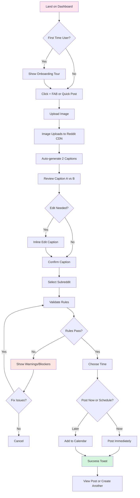
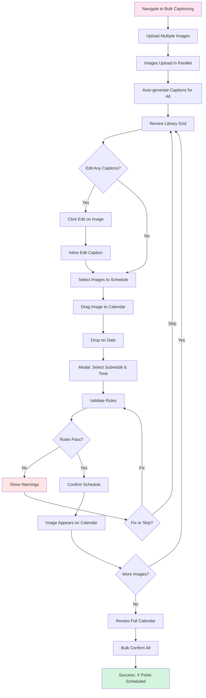
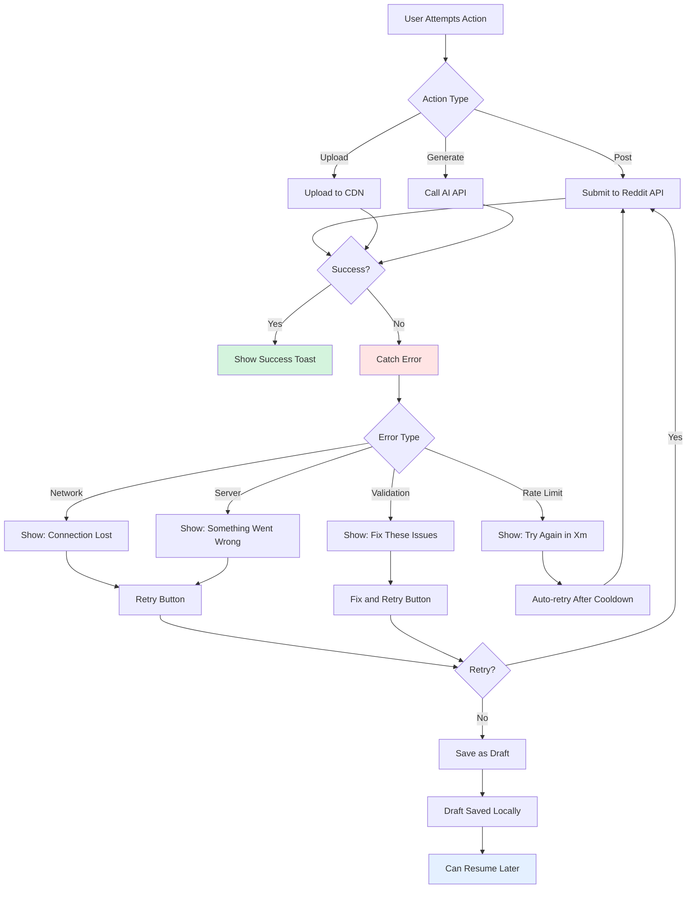
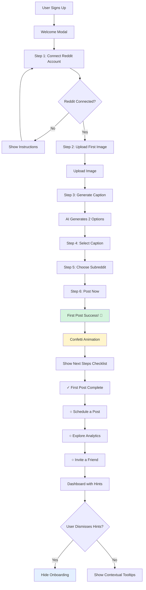

# Design Document

## Overview

This design document outlines the technical architecture and implementation approach for transforming ThottoPilot into an enterprise-grade, Apple-level user experience. The design focuses on modular components, consistent patterns, and scalable architecture that supports both the Bubblegum Pink and Midnight Rose themes while maintaining accessibility and performance.

## Architecture

### High-Level System Architecture

```
┌─────────────────────────────────────────────────────────────┐
│                     Presentation Layer                       │
├─────────────────────────────────────────────────────────────┤
│  ┌──────────────┐  ┌──────────────┐  ┌──────────────┐      │
│  │   Pages      │  │  Layouts     │  │  Components  │      │
│  │              │  │              │  │              │      │
│  │ - Dashboard  │  │ - TwoPane    │  │ - FAB        │      │
│  │ - QuickPost  │  │ - Sidebar    │  │ - StatusBar  │      │
│  │ - Calendar   │  │ - Grid       │  │ - Cards      │      │
│  └──────────────┘  └──────────────┘  └──────────────┘      │
├─────────────────────────────────────────────────────────────┤
│                      State Management                        │
├─────────────────────────────────────────────────────────────┤
│  ┌──────────────┐  ┌──────────────┐  ┌──────────────┐      │
│  │ TanStack     │  │  Context     │  │  Local State │      │
│  │ Query        │  │  Providers   │  │              │      │
│  │              │  │              │  │ - Theme      │      │
│  │ - Server     │  │ - Auth       │  │ - UI State   │      │
│  │   State      │  │ - Theme      │  │ - Forms      │      │
│  └──────────────┘  └──────────────┘  └──────────────┘      │
├─────────────────────────────────────────────────────────────┤
│                      Design System                           │
├─────────────────────────────────────────────────────────────┤
│  ┌──────────────┐  ┌──────────────┐  ┌──────────────┐      │
│  │   Tokens     │  │  Primitives  │  │  Patterns    │      │
│  │              │  │              │  │              │      │
│  │ - Colors     │  │ - Button     │  │ - Forms      │      │
│  │ - Typography │  │ - Input      │  │ - Lists      │      │
│  │ - Spacing    │  │ - Card       │  │ - Modals     │      │
│  └──────────────┘  └──────────────┘  └──────────────┘      │
└─────────────────────────────────────────────────────────────┘
```

### Component Hierarchy


```
App
├── ThemeProvider (Bubblegum Pink / Midnight Rose)
│   ├── HeaderEnhanced
│   │   ├── Logo
│   │   ├── WorkflowNavigation (Create/Protect/Schedule/Analyze)
│   │   ├── CommandPalette (Cmd+K)
│   │   └── UserMenu
│   │
│   ├── Sidebar (Desktop) / HamburgerMenu (Mobile)
│   │   ├── WorkflowSections
│   │   │   ├── Create
│   │   │   │   ├── Quick Post
│   │   │   │   ├── Bulk Captioning
│   │   │   │   └── Draft Library
│   │   │   ├── Protect
│   │   │   │   ├── ImageShield
│   │   │   │   ├── Rule Checker
│   │   │   │   └── Cooldown Monitor
│   │   │   ├── Schedule
│   │   │   │   ├── Queue
│   │   │   │   ├── Calendar
│   │   │   │   └── Campaigns
│   │   │   └── Analyze
│   │   │       ├── Performance
│   │   │       ├── Subreddit Insights
│   │   │       └── Tax Tracker
│   │   └── ThemeSwitcher
│   │
│   ├── MainContent
│   │   ├── StatusBanner (Tier limits, cooldowns, alerts)
│   │   ├── Breadcrumbs (Desktop) / BackButton (Mobile)
│   │   └── PageContent
│   │       ├── Dashboard (12-column grid)
│   │       ├── QuickPost (Two-pane layout)
│   │       ├── BulkCaptioning (Three-pane: Upload/Library/Calendar)
│   │       ├── Calendar (Drag-and-drop scheduling)
│   │       └── Analytics (Charts + insights)
│   │
│   ├── FloatingActionButton (+ Create)
│   │   └── CreateModal
│   │       ├── Quick Post
│   │       ├── Bulk Upload
│   │       ├── Schedule Post
│   │       └── Draft
│   │
│   └── GlobalComponents
│       ├── Toaster (Top-center, Apple-style)
│       ├── CommandPalette (Cmd+K)
│       ├── ConfirmDialog
│       └── LoadingOverlay
```

## Design System

### 1. Theme Architecture

**File Structure:**
```
client/src/styles/
├── themes/
│   ├── index.ts                    # Theme exports
│   ├── bubblegum-pink.ts           # Light theme
│   ├── midnight-rose.ts            # Dark theme
│   ├── tokens.ts                   # Shared design tokens
│   └── theme-provider.tsx          # Theme context
├── animations/
│   ├── spring.ts                   # Spring physics
│   ├── transitions.ts              # Page transitions
│   └── micro-interactions.ts       # Hover, focus effects
└── utilities/
    ├── contrast-checker.ts         # WCAG validation
    ├── color-utils.ts              # Color manipulation
    └── responsive.ts               # Breakpoint utilities
```

**Theme Provider Implementation:**
```typescript
// client/src/styles/themes/theme-provider.tsx
import { createContext, useContext, useEffect, useState } from 'react';
import { bubblegumPinkTheme } from './bubblegum-pink';
import { midnightRoseTheme } from './midnight-rose';

type ThemeName = 'bubblegum-pink' | 'midnight-rose' | 'system';
type Theme = typeof bubblegumPinkTheme;

interface ThemeContextValue {
  theme: Theme;
  themeName: ThemeName;
  setTheme: (name: ThemeName) => void;
  toggleTheme: () => void;
}

const ThemeContext = createContext<ThemeContextValue | undefined>(undefined);

export function ThemeProvider({ children }: { children: React.ReactNode }) {
  const [themeName, setThemeName] = useState<ThemeName>('system');
  const [resolvedTheme, setResolvedTheme] = useState<Theme>(bubblegumPinkTheme);

  useEffect(() => {
    // Load saved preference
    const saved = localStorage.getItem('theme') as ThemeName;
    if (saved) setThemeName(saved);
  }, []);

  useEffect(() => {
    // Resolve theme
    let theme: Theme;
    if (themeName === 'system') {
      const prefersDark = window.matchMedia('(prefers-color-scheme: dark)').matches;
      theme = prefersDark ? midnightRoseTheme : bubblegumPinkTheme;
    } else {
      theme = themeName === 'midnight-rose' ? midnightRoseTheme : bubblegumPinkTheme;
    }
    
    setResolvedTheme(theme);
    applyThemeToDOM(theme);
    localStorage.setItem('theme', themeName);
  }, [themeName]);

  return (
    <ThemeContext.Provider value={{ 
      theme: resolvedTheme, 
      themeName, 
      setTheme: setThemeName,
      toggleTheme: () => setThemeName(prev => 
        prev === 'bubblegum-pink' ? 'midnight-rose' : 'bubblegum-pink'
      )
    }}>
      {children}
    </ThemeContext.Provider>
  );
}

function applyThemeToDOM(theme: Theme) {
  const root = document.documentElement;
  
  // Apply CSS variables
  Object.entries(theme).forEach(([key, value]) => {
    if (typeof value === 'object') {
      Object.entries(value).forEach(([subKey, subValue]) => {
        root.style.setProperty(`--${key}-${subKey}`, subValue);
      });
    } else {
      root.style.setProperty(`--${key}`, value);
    }
  });
}
```

### 2. Design Tokens


**Spacing Scale (4px base unit):**
```typescript
export const spacing = {
  0: '0',
  1: '0.25rem',  // 4px
  2: '0.5rem',   // 8px
  3: '0.75rem',  // 12px
  4: '1rem',     // 16px - element spacing
  5: '1.25rem',  // 20px
  6: '1.5rem',   // 24px - card padding
  8: '2rem',     // 32px - section spacing
  10: '2.5rem',  // 40px
  12: '3rem',    // 48px
  16: '4rem',    // 64px
  20: '5rem',    // 80px
  24: '6rem',    // 96px
};
```

**Typography Scale (Apple-inspired):**
```typescript
export const typography = {
  display: {
    fontSize: '4.5rem',      // 72px
    lineHeight: '5rem',      // 80px
    fontWeight: 700,
    letterSpacing: '-0.02em',
  },
  h1: {
    fontSize: '3rem',        // 48px
    lineHeight: '3.5rem',    // 56px
    fontWeight: 700,
    letterSpacing: '-0.01em',
  },
  h2: {
    fontSize: '2.25rem',     // 36px
    lineHeight: '2.75rem',   // 44px
    fontWeight: 600,
  },
  h3: {
    fontSize: '1.5rem',      // 24px
    lineHeight: '2rem',      // 32px
    fontWeight: 600,
  },
  body: {
    fontSize: '1.0625rem',   // 17px (Apple standard)
    lineHeight: '1.5rem',    // 24px
    fontWeight: 400,
  },
  caption: {
    fontSize: '0.8125rem',   // 13px
    lineHeight: '1.125rem',  // 18px
    fontWeight: 400,
  },
  label: {
    fontSize: '0.9375rem',   // 15px
    lineHeight: '1.25rem',   // 20px
    fontWeight: 500,
  },
};
```

**Border Radius Scale:**
```typescript
export const borderRadius = {
  none: '0',
  sm: '0.25rem',   // 4px
  md: '0.5rem',    // 8px
  lg: '0.75rem',   // 12px
  xl: '1rem',      // 16px
  '2xl': '1.5rem', // 24px
  full: '9999px',  // Pill shape
};
```

**Animation Tokens:**
```typescript
export const animation = {
  duration: {
    fast: '150ms',
    normal: '300ms',
    slow: '500ms',
  },
  easing: {
    // Spring physics (Apple-style)
    spring: 'cubic-bezier(0.34, 1.56, 0.64, 1)',
    // Smooth ease
    smooth: 'cubic-bezier(0.4, 0, 0.2, 1)',
    // Ease in/out
    inOut: 'cubic-bezier(0.4, 0, 0.6, 1)',
  },
};
```

## Components and Interfaces

### 3. Core Layout Components

**TwoPane Layout:**
```typescript
// client/src/components/layouts/TwoPane.tsx
interface TwoPaneProps {
  leftPane: React.ReactNode;
  rightPane: React.ReactNode;
  leftWidth?: '30%' | '40%' | '50%';
  sticky?: boolean;
  mobileStack?: boolean;
}

export function TwoPane({ 
  leftPane, 
  rightPane, 
  leftWidth = '40%',
  sticky = false,
  mobileStack = true 
}: TwoPaneProps) {
  return (
    <div className="flex flex-col lg:flex-row gap-6 h-full">
      {/* Left Pane */}
      <div 
        className={cn(
          "flex-shrink-0",
          sticky && "lg:sticky lg:top-20 lg:h-[calc(100vh-5rem)]",
          mobileStack && "w-full lg:w-[var(--left-width)]"
        )}
        style={{ '--left-width': leftWidth } as React.CSSProperties}
      >
        <Card className="h-full overflow-auto">
          {leftPane}
        </Card>
      </div>
      
      {/* Right Pane */}
      <div className="flex-1 min-w-0">
        <Card className="h-full overflow-auto">
          {rightPane}
        </Card>
      </div>
    </div>
  );
}
```

**DashboardGrid Layout:**
```typescript
// client/src/components/layouts/DashboardGrid.tsx
interface DashboardGridProps {
  mainContent: React.ReactNode;
  sidebar?: React.ReactNode;
  fullWidth?: boolean;
}

export function DashboardGrid({ 
  mainContent, 
  sidebar, 
  fullWidth = false 
}: DashboardGridProps) {
  return (
    <div className="grid grid-cols-1 lg:grid-cols-12 gap-6">
      {/* Main Content */}
      <div className={cn(
        "col-span-1",
        fullWidth ? "lg:col-span-12" : "lg:col-span-8"
      )}>
        {mainContent}
      </div>
      
      {/* Sidebar */}
      {sidebar && !fullWidth && (
        <aside className="col-span-1 lg:col-span-4">
          {sidebar}
        </aside>
      )}
    </div>
  );
}
```

### 4. Navigation Components

**WorkflowNavigation (Header Dropdowns):**
```typescript
// client/src/components/navigation/WorkflowNavigation.tsx
import { workflowBuckets } from '@/config/navigation';

export function WorkflowNavigation() {
  const { user } = useAuth();
  
  return (
    <nav className="hidden md:flex items-center gap-2">
      {workflowBuckets.map(bucket => (
        <DropdownMenu key={bucket.key}>
          <DropdownMenuTrigger asChild>
            <Button variant="ghost" className="gap-2">
              {bucket.label}
              <ChevronDown className="h-4 w-4" />
            </Button>
          </DropdownMenuTrigger>
          <DropdownMenuContent align="start" className="w-64">
            <DropdownMenuLabel>
              {bucket.description}
            </DropdownMenuLabel>
            <DropdownMenuSeparator />
            {bucket.routes.map(route => (
              <DropdownMenuItem key={route.key} asChild>
                <Link href={route.href} className="flex items-center gap-3">
                  <route.icon className="h-4 w-4" />
                  <div className="flex-1">
                    <div className="font-medium">{route.label}</div>
                    <div className="text-xs text-muted-foreground">
                      {route.description}
                    </div>
                  </div>
                  {route.shortcut && (
                    <kbd className="text-xs">{route.shortcut}</kbd>
                  )}
                </Link>
              </DropdownMenuItem>
            ))}
          </DropdownMenuContent>
        </DropdownMenu>
      ))}
    </nav>
  );
}
```

**Sidebar (Desktop):**
```typescript
// client/src/components/navigation/Sidebar.tsx
export function Sidebar() {
  const [location] = useLocation();
  const { user } = useAuth();
  
  return (
    <aside className="hidden lg:block w-64 border-r border-border bg-surface-primary">
      <ScrollArea className="h-[calc(100vh-4rem)]">
        <div className="p-4 space-y-6">
          {workflowBuckets.map(bucket => (
            <div key={bucket.key}>
              <h3 className="text-sm font-semibold text-text-secondary mb-2">
                {bucket.label}
              </h3>
              <div className="space-y-1">
                {bucket.routes.map(route => {
                  const isActive = location === route.href;
                  return (
                    <Link key={route.key} href={route.href}>
                      <div className={cn(
                        "flex items-center gap-3 px-3 py-2 rounded-lg",
                        "transition-all duration-200",
                        isActive 
                          ? "bg-accent-pink-100 text-accent-pink-600 font-semibold" 
                          : "hover:bg-surface-secondary text-text-primary"
                      )}>
                        <route.icon className="h-4 w-4" />
                        <span className="flex-1">{route.label}</span>
                        {route.proOnly && (
                          <Badge variant="pro" size="sm">Pro</Badge>
                        )}
                      </div>
                    </Link>
                  );
                })}
              </div>
            </div>
          ))}
        </div>
      </ScrollArea>
    </aside>
  );
}
```

### 5. Floating Action Button (FAB)


```typescript
// client/src/components/ui/floating-action-button.tsx
import { Plus, Sparkles, Upload, Calendar, FileText } from 'lucide-react';
import { useState, useEffect } from 'react';
import { useLocation } from 'wouter';

const HIDDEN_ROUTES = ['/quick-post', '/bulk-caption', '/post-scheduling'];

export function FloatingActionButton() {
  const [location, navigate] = useLocation();
  const [showModal, setShowModal] = useState(false);
  const [isHidden, setIsHidden] = useState(false);

  useEffect(() => {
    setIsHidden(HIDDEN_ROUTES.includes(location));
  }, [location]);

  useEffect(() => {
    // Keyboard shortcut: Cmd+N / Ctrl+N
    const handleKeyDown = (e: KeyboardEvent) => {
      if ((e.metaKey || e.ctrlKey) && e.key === 'n') {
        e.preventDefault();
        setShowModal(true);
      }
    };
    
    window.addEventListener('keydown', handleKeyDown);
    return () => window.removeEventListener('keydown', handleKeyDown);
  }, []);

  if (isHidden) return null;

  return (
    <>
      {/* FAB Button */}
      <button
        onClick={() => setShowModal(true)}
        className={cn(
          "fixed bottom-6 right-6 z-50",
          "w-14 h-14 md:w-16 md:h-16",
          "bg-gradient-to-r from-pink-500 to-pink-600",
          "text-white rounded-full shadow-2xl",
          "hover:scale-110 active:scale-95",
          "transition-all duration-200",
          "flex items-center justify-center",
          "shadow-pink-500/50 hover:shadow-pink-500/70",
          "group"
        )}
        aria-label="Create new post"
      >
        <Plus className="h-6 w-6 md:h-7 md:h-7 group-hover:rotate-90 transition-transform duration-300" />
      </button>

      {/* Create Modal */}
      <Dialog open={showModal} onOpenChange={setShowModal}>
        <DialogContent className="sm:max-w-md">
          <DialogHeader>
            <DialogTitle>Create New Content</DialogTitle>
            <DialogDescription>
              Choose how you want to create your next post
            </DialogDescription>
          </DialogHeader>
          
          <div className="grid gap-3 py-4">
            <CreateOption
              icon={Sparkles}
              title="Quick Post"
              description="Upload one image and post instantly"
              onClick={() => {
                navigate('/quick-post');
                setShowModal(false);
              }}
              shortcut="⌘N"
            />
            
            <CreateOption
              icon={Upload}
              title="Bulk Upload"
              description="Upload multiple images at once"
              onClick={() => {
                navigate('/bulk-caption');
                setShowModal(false);
              }}
              shortcut="⌘U"
            />
            
            <CreateOption
              icon={Calendar}
              title="Schedule Post"
              description="Plan content for later"
              onClick={() => {
                navigate('/post-scheduling');
                setShowModal(false);
              }}
              shortcut="⌘S"
            />
            
            <CreateOption
              icon={FileText}
              title="Draft"
              description="Save work in progress"
              onClick={() => {
                navigate('/drafts');
                setShowModal(false);
              }}
            />
          </div>
        </DialogContent>
      </Dialog>
    </>
  );
}

function CreateOption({ icon: Icon, title, description, onClick, shortcut }: {
  icon: React.ComponentType<{ className?: string }>;
  title: string;
  description: string;
  onClick: () => void;
  shortcut?: string;
}) {
  return (
    <button
      onClick={onClick}
      className={cn(
        "flex items-center gap-4 p-4 rounded-lg",
        "border border-border-medium",
        "hover:border-pink-400/50 hover:bg-surface-secondary",
        "transition-all duration-200",
        "text-left group"
      )}
    >
      <div className="p-3 bg-pink-100 dark:bg-pink-400/20 rounded-lg group-hover:scale-110 transition-transform">
        <Icon className="h-5 w-5 text-pink-600 dark:text-pink-400" />
      </div>
      <div className="flex-1">
        <div className="font-semibold text-text-primary">{title}</div>
        <div className="text-sm text-text-secondary">{description}</div>
      </div>
      {shortcut && (
        <kbd className="px-2 py-1 text-xs bg-surface-elevated rounded border border-border-light">
          {shortcut}
        </kbd>
      )}
    </button>
  );
}
```

### 6. Status Banner System

```typescript
// client/src/components/ui/status-banner.tsx
import { AlertTriangle, Info, CheckCircle, XCircle, X } from 'lucide-react';

type BannerVariant = 'info' | 'warning' | 'success' | 'error';

interface StatusBannerProps {
  variant: BannerVariant;
  message: string;
  action?: {
    label: string;
    onClick: () => void;
  };
  dismissible?: boolean;
  onDismiss?: () => void;
}

const variantConfig = {
  info: {
    icon: Info,
    className: 'bg-blue-50 dark:bg-blue-950/30 border-blue-200 dark:border-blue-800 text-blue-900 dark:text-blue-100',
  },
  warning: {
    icon: AlertTriangle,
    className: 'bg-yellow-50 dark:bg-yellow-950/30 border-yellow-200 dark:border-yellow-800 text-yellow-900 dark:text-yellow-100',
  },
  success: {
    icon: CheckCircle,
    className: 'bg-green-50 dark:bg-green-950/30 border-green-200 dark:border-green-800 text-green-900 dark:text-green-100',
  },
  error: {
    icon: XCircle,
    className: 'bg-red-50 dark:bg-red-950/30 border-red-200 dark:border-red-800 text-red-900 dark:text-red-100',
  },
};

export function StatusBanner({ 
  variant, 
  message, 
  action, 
  dismissible = true,
  onDismiss 
}: StatusBannerProps) {
  const config = variantConfig[variant];
  const Icon = config.icon;

  return (
    <div className={cn(
      "flex items-center gap-3 px-4 py-3 border rounded-lg",
      "animate-in slide-in-from-top duration-300",
      config.className
    )}>
      <Icon className="h-5 w-5 flex-shrink-0" />
      <p className="flex-1 text-sm font-medium">{message}</p>
      
      {action && (
        <Button
          onClick={action.onClick}
          size="sm"
          variant="ghost"
          className="font-semibold"
        >
          {action.label}
        </Button>
      )}
      
      {dismissible && (
        <button
          onClick={onDismiss}
          className="p-1 hover:bg-black/10 dark:hover:bg-white/10 rounded transition-colors"
          aria-label="Dismiss"
        >
          <X className="h-4 w-4" />
        </button>
      )}
    </div>
  );
}

// Usage in pages
export function StatusBannerContainer() {
  const { user } = useAuth();
  const [banners, setBanners] = useState<Array<{ id: string; props: StatusBannerProps }>>([]);

  // Check tier limits
  useEffect(() => {
    if (user?.tier === 'free' && user.captionsUsed >= user.captionsLimit * 0.8) {
      setBanners(prev => [...prev, {
        id: 'tier-limit',
        props: {
          variant: 'warning',
          message: `⚠️ Only ${user.captionsLimit - user.captionsUsed} AI captions left this month.`,
          action: {
            label: 'Upgrade to Pro',
            onClick: () => navigate('/settings'),
          },
        },
      }]);
    }
  }, [user]);

  return (
    <div className="space-y-2">
      {banners.map(banner => (
        <StatusBanner
          key={banner.id}
          {...banner.props}
          onDismiss={() => setBanners(prev => prev.filter(b => b.id !== banner.id))}
        />
      ))}
    </div>
  );
}
```

### 7. Command Palette (Cmd+K)

```typescript
// client/src/components/ui/command-palette.tsx
import { useEffect, useState } from 'react';
import { useLocation } from 'wouter';
import { Command } from 'cmdk';
import { getCommandPaletteItems } from '@/config/navigation';

export function CommandPalette() {
  const [open, setOpen] = useState(false);
  const [, navigate] = useLocation();

  useEffect(() => {
    const down = (e: KeyboardEvent) => {
      if (e.key === 'k' && (e.metaKey || e.ctrlKey)) {
        e.preventDefault();
        setOpen(open => !open);
      }
    };

    document.addEventListener('keydown', down);
    return () => document.removeEventListener('keydown', down);
  }, []);

  const commands = getCommandPaletteItems(navigate, {
    generateCaption: () => console.log('Generate'),
    showUpgrade: () => navigate('/settings'),
    logout: () => navigate('/logout'),
  });

  return (
    <Dialog open={open} onOpenChange={setOpen}>
      <DialogContent className="p-0 max-w-2xl">
        <Command className="rounded-lg border-0">
          <CommandInput placeholder="Search or jump to..." />
          <CommandList>
            <CommandEmpty>No results found.</CommandEmpty>
            
            <CommandGroup heading="Navigation">
              {commands.filter(cmd => cmd.id.startsWith('nav-')).map(cmd => (
                <CommandItem
                  key={cmd.id}
                  onSelect={() => {
                    cmd.action();
                    setOpen(false);
                  }}
                >
                  {cmd.icon && <cmd.icon className="mr-2 h-4 w-4" />}
                  <span>{cmd.label}</span>
                  {cmd.shortcut && (
                    <kbd className="ml-auto text-xs">{cmd.shortcut}</kbd>
                  )}
                </CommandItem>
              ))}
            </CommandGroup>
            
            <CommandGroup heading="Actions">
              {commands.filter(cmd => cmd.id.startsWith('action-')).map(cmd => (
                <CommandItem
                  key={cmd.id}
                  onSelect={() => {
                    cmd.action();
                    setOpen(false);
                  }}
                >
                  {cmd.icon && <cmd.icon className="mr-2 h-4 w-4" />}
                  <span>{cmd.label}</span>
                </CommandItem>
              ))}
            </CommandGroup>
          </CommandList>
        </Command>
      </DialogContent>
    </Dialog>
  );
}
```

## Data Models

### 8. Theme Data Model

```typescript
// client/src/types/theme.ts
export interface ThemeColors {
  background: {
    primary: string;
    secondary: string;
    tertiary: string;
  };
  surface: {
    primary: string;
    secondary: string;
    elevated: string;
    glass: string;
  };
  text: {
    primary: string;
    secondary: string;
    tertiary: string;
    disabled: string;
  };
  accent: {
    pink: ColorScale;
    blue: ColorScale;
    purple: ColorScale;
  };
  border: {
    subtle: string;
    light: string;
    medium: string;
    strong: string;
  };
  shadow: {
    sm: string;
    md: string;
    lg: string;
    xl: string;
  };
}

export interface ColorScale {
  50: string;
  100: string;
  200: string;
  300: string;
  400: string;
  500: string;
  600: string;
  700: string;
  800: string;
  900: string;
}

export interface Theme {
  name: string;
  colors: ThemeColors;
  typography: TypographyScale;
  spacing: SpacingScale;
  borderRadius: BorderRadiusScale;
  animation: AnimationTokens;
}
```

### 9. Drag-and-Drop Data Model

```typescript
// client/src/types/scheduling.ts
export interface SchedulableImage {
  id: string;
  url: string;
  thumbnailUrl: string;
  caption: string;
  captionEdited: boolean;
  tags: string[];
  nsfw: boolean;
  assetId?: number;
  protectedUrl?: string;
}

export interface ScheduledPost {
  id: string;
  imageId: string;
  subreddit: string;
  scheduledFor: Date;
  status: 'pending' | 'processing' | 'completed' | 'failed';
  title: string;
  caption: string;
  nsfw: boolean;
}

export interface CalendarDay {
  date: Date;
  posts: ScheduledPost[];
  isToday: boolean;
  isPast: boolean;
  isBeyondTierLimit: boolean;
}
```

## Error Handling

### 10. Error Boundary Strategy

```typescript
// client/src/components/error-boundary.tsx
export class ErrorBoundary extends React.Component<
  { children: React.ReactNode },
  { hasError: boolean; error: Error | null }
> {
  state = { hasError: false, error: null };

  static getDerivedStateFromError(error: Error) {
    return { hasError: true, error };
  }

  componentDidCatch(error: Error, errorInfo: React.ErrorInfo) {
    console.error('Error caught by boundary:', error, errorInfo);
    // Log to error tracking service (e.g., Sentry)
  }

  render() {
    if (this.state.hasError) {
      return (
        <div className="min-h-screen flex items-center justify-center p-4">
          <Card className="max-w-md">
            <CardHeader>
              <CardTitle>Something went wrong</CardTitle>
              <CardDescription>
                We're sorry, but something unexpected happened.
              </CardDescription>
            </CardHeader>
            <CardContent className="space-y-4">
              <p className="text-sm text-muted-foreground">
                {this.state.error?.message}
              </p>
              <div className="flex gap-2">
                <Button onClick={() => window.location.reload()}>
                  Reload Page
                </Button>
                <Button variant="outline" onClick={() => window.history.back()}>
                  Go Back
                </Button>
              </div>
            </CardContent>
          </Card>
        </div>
      );
    }

    return this.props.children;
  }
}
```

## Testing Strategy

### 11. Component Testing Approach

- **Unit Tests:** All utility functions, hooks, and isolated components
- **Integration Tests:** Multi-component workflows (upload → caption → schedule)
- **Visual Regression:** Storybook + Chromatic for theme consistency
- **Accessibility Tests:** axe-core + manual keyboard navigation
- **Performance Tests:** Lighthouse CI for each page

### 12. Test Coverage Goals

- Utilities: 90%+
- Components: 80%+
- Pages: 70%+
- E2E Critical Paths: 100%

## Performance Optimization

### 13. Code Splitting Strategy

```typescript
// Lazy load heavy components
const BulkCaptioning = lazy(() => import('@/pages/bulk-captioning'));
const Calendar = lazy(() => import('@/pages/scheduling-calendar'));
const Analytics = lazy(() => import('@/pages/analytics'));

// Prefetch on hover
<Link 
  href="/analytics" 
  onMouseEnter={() => import('@/pages/analytics')}
>
  Analytics
</Link>
```

### 14. Image Optimization

- Use `loading="lazy"` for all images
- Implement blur-up technique for thumbnails
- Generate multiple sizes (320w, 640w, 1280w)
- Use WebP with JPEG fallback

---

**Next: Implementation tasks will break this design into actionable coding steps.**


---

## Visual Wireframes & User Flows

### Wireframe 1: Dashboard (12-Column Grid)

```
┌─────────────────────────────────────────────────────────────────────────────┐
│ Header: [Logo] [Create▾] [Protect▾] [Schedule▾] [Analyze▾]    [🔍] [👤]    │
├─────────────────────────────────────────────────────────────────────────────┤
│ ┌─────────────────────────────────────────────┐ ┌─────────────────────────┐ │
│ │ Status Banner (if applicable)               │ │                         │ │
│ │ ⚠️ Only 5 AI captions left [Upgrade to Pro] │ │                         │ │
│ └─────────────────────────────────────────────┘ │                         │ │
│                                                   │                         │ │
│ ┌──────────────────────────────────────────────┐ │  ┌───────────────────┐ │ │
│ │ Main Content (8 columns)                     │ │  │ Sidebar (4 cols)  │ │ │
│ │                                              │ │  │                   │ │ │
│ │ ┌──────────────┐ ┌──────────────┐          │ │  │ 📊 This Week      │ │ │
│ │ │ Quick Action │ │ Quick Action │          │ │  │ ─────────────────  │ │ │
│ │ │              │ │              │          │ │  │ 47 Posts          │ │ │
│ │ │ ✨ Quick Post│ │ 📅 Schedule  │          │ │  │ 8.4% Engagement   │ │ │
│ │ │              │ │              │          │ │  │ +12% ↗            │ │ │
│ │ └──────────────┘ └──────────────┘          │ │  │                   │ │ │
│ │                                              │ │  │ 🎯 Best Time      │ │ │
│ │ ┌────────────────────────────────────────┐  │ │  │ ─────────────────  │ │ │
│ │ │ Recent Activity                        │  │ │  │ 2:00 PM - 4:00 PM │ │ │
│ │ │ ────────────────────────────────────── │  │ │  │ 85% success rate  │ │ │
│ │ │ [img] Posted to r/FitGirls    2h ago  │  │ │  │                   │ │ │
│ │ │ [img] Scheduled for r/Gym     4h ago  │  │ │  │ 🔥 Trending       │ │ │
│ │ │ [img] Caption generated       6h ago  │  │ │  │ ─────────────────  │ │ │
│ │ └────────────────────────────────────────┘  │ │  │ r/FitGirls        │ │ │
│ └──────────────────────────────────────────────┘ │  │ r/GymGirls        │ │ │
│                                                   │  │ r/Workouts        │ │ │
│                                                   │  └───────────────────┘ │ │
│                                                   │                         │ │
│                                                   │  [Upgrade to Pro]       │ │
│                                                   └─────────────────────────┘ │
│                                                                               │
│ [+] FAB (bottom-right)                                                        │
└─────────────────────────────────────────────────────────────────────────────┘
```

### Wireframe 2: Quick Post (Two-Pane Layout)

```
┌─────────────────────────────────────────────────────────────────────────────┐
│ Header: [Logo] [Create▾] [Protect▾] [Schedule▾] [Analyze▾]    [🔍] [👤]    │
├─────────────────────────────────────────────────────────────────────────────┤
│ Breadcrumbs: Create > Quick Post                                             │
├─────────────────────────────────────────────────────────────────────────────┤
│                                                                               │
│ ┌─────────────────────────────────┐ ┌───────────────────────────────────┐   │
│ │ LEFT PANE (40%)                 │ │ RIGHT PANE (60%)                  │   │
│ │ ─────────────────────────────── │ │ ───────────────────────────────── │   │
│ │                                 │ │                                   │   │
│ │ [1] 📤 Upload Image             │ │ ✨ Generated Captions             │   │
│ │ ┌─────────────────────────────┐ │ │                                   │   │
│ │ │                             │ │ │ ┌───────────────────────────────┐ │   │
│ │ │   [Drag & Drop Zone]        │ │ │ │ A: Flirty & Playful          │ │   │
│ │ │   or click to browse        │ │ │ │ ───────────────────────────── │ │   │
│ │ │                             │ │ │ │ "Just wrapped my morning     │ │   │
│ │ └─────────────────────────────┘ │ │ │  workout 💪 Feeling that     │ │   │
│ │                                 │ │ │  post-gym glow ✨"           │ │   │
│ │ [2] 🎭 Select Persona           │ │ │                               │ │   │
│ │ ○ Bratty Tease                  │ │ │ [Edit] [Copy] [Regenerate]    │ │   │
│ │ ● Seductive Goddess             │ │ └───────────────────────────────┘ │   │
│ │ ○ Playful Flirt                 │ │                                   │   │
│ │                                 │ │ ┌───────────────────────────────┐ │   │
│ │ [3] 🎨 Choose Tone              │ │ │ B: Sultry & Confident        │ │   │
│ │ [😘 Flirty] [💪 Confident]     │ │ │ ───────────────────────────── │ │   │
│ │ [😏 Teasing] [😊 Casual]       │ │ │ "Morning sweat session done  │ │   │
│ │                                 │ │ │  Who wants to help me cool   │ │   │
│ │ [4] 🏷️ Add Tags                 │ │ │  down? 😈💦"                 │ │   │
│ │ [gym] [workout] [fitness] [+]   │ │ │                               │ │   │
│ │                                 │ │ │ [Edit] [Copy] [Regenerate]    │ │   │
│ │ [5] 🔞 NSFW Toggle              │ │ └───────────────────────────────┘ │   │
│ │ [●────] Yes                     │ │                                   │   │
│ │                                 │ │ [Confirm Caption A] ✓             │   │
│ │ ┌─────────────────────────────┐ │ │                                   │   │
│ │ │ [✨ Generate Captions]      │ │ │ 📅 Schedule Post                  │   │
│ │ └─────────────────────────────┘ │ │ ───────────────────────────────   │   │
│ │                                 │ │ Subreddit: [r/FitGirls ▾]         │   │
│ │                                 │ │ Date: [Oct 29, 2025]              │   │
│ │                                 │ │ Time: [2:30 PM] (Best time ⭐)    │   │
│ │                                 │ │                                   │   │
│ │                                 │ │ [Post Now] [Schedule]             │   │
│ └─────────────────────────────────┘ └───────────────────────────────────┘   │
│                                                                               │
└─────────────────────────────────────────────────────────────────────────────┘
```

### Wireframe 3: Bulk Captioning (Three-Pane Layout)

```
┌─────────────────────────────────────────────────────────────────────────────┐
│ Header: [Logo] [Create▾] [Protect▾] [Schedule▾] [Analyze▾]    [🔍] [👤]    │
├─────────────────────────────────────────────────────────────────────────────┤
│ Breadcrumbs: Create > Bulk Captioning                                        │
├─────────────────────────────────────────────────────────────────────────────┤
│                                                                               │
│ ┌──────────────┐ ┌────────────────────────────────┐ ┌──────────────────┐   │
│ │ UPLOAD       │ │ CONTENT LIBRARY                │ │ CALENDAR         │   │
│ │ (20%)        │ │ (50%)                          │ │ (30%)            │   │
│ │ ──────────── │ │ ────────────────────────────── │ │ ──────────────── │   │
│ │              │ │                                │ │                  │   │
│ │ ┌──────────┐ │ │ [Select All] [Generate All]    │ │ October 2025     │   │
│ │ │          │ │ │                                │ │ ← [    ] →       │   │
│ │ │  Drag &  │ │ │ ┌────┐ ┌────┐ ┌────┐ ┌────┐   │ │                  │   │
│ │ │   Drop   │ │ │ │[✓] │ │[✓] │ │[ ] │ │[ ] │   │ │ Su Mo Tu We Th..│   │
│ │ │  Images  │ │ │ │img1│ │img2│ │img3│ │img4│   │ │ 27 28 29 30 31  │   │
│ │ │   Here   │ │ │ │    │ │    │ │    │ │    │   │ │ [2] [ ] [ ] [ ] │   │
│ │ │          │ │ │ │📝  │ │📝  │ │⏳  │ │⏳  │   │ │                  │   │
│ │ └──────────┘ │ │ └────┘ └────┘ └────┘ └────┘   │ │ [img] r/FitGirls │   │
│ │              │ │                                │ │ 2:30 PM          │   │
│ │ [Browse]     │ │ ┌────┐ ┌────┐ ┌────┐ ┌────┐   │ │                  │   │
│ │              │ │ │[ ] │ │[ ] │ │[ ] │ │[ ] │   │ │ [img] r/Gym      │   │
│ │ Progress:    │ │ │img5│ │img6│ │img7│ │img8│   │ │ 4:30 PM          │   │
│ │ ████░░ 60%   │ │ │    │ │    │ │    │ │    │   │ │                  │   │
│ │              │ │ │⏳  │ │⏳  │ │⏳  │ │⏳  │   │ │ Drop images here │   │
│ │ 3 of 5       │ │ └────┘ └────┘ └────┘ └────┘   │ │ to schedule      │   │
│ │ uploaded     │ │                                │ │                  │   │
│ │              │ │ [Edit Caption] [Schedule]      │ │ Tier Limit:      │   │
│ │              │ │                                │ │ 5 of 7 days used │   │
│ └──────────────┘ └────────────────────────────────┘ └──────────────────┘   │
│                                                                               │
│ Instructions: 1) Upload images  2) Review captions  3) Drag to calendar      │
└─────────────────────────────────────────────────────────────────────────────┘
```

### Wireframe 4: Calendar View (Drag-and-Drop)

```
┌─────────────────────────────────────────────────────────────────────────────┐
│ Header: [Logo] [Create▾] [Protect▾] [Schedule▾] [Analyze▾]    [🔍] [👤]    │
├─────────────────────────────────────────────────────────────────────────────┤
│ Breadcrumbs: Schedule > Calendar                                             │
├─────────────────────────────────────────────────────────────────────────────┤
│                                                                               │
│ ┌─────────────────────────────────────────────────────────────────────────┐ │
│ │ October 2025                          [Month ▾] [Week] [Day]  [+ New]  │ │
│ │ ← [                                                              ] →    │ │
│ ├─────────────────────────────────────────────────────────────────────────┤ │
│ │ Sun       Mon       Tue       Wed       Thu       Fri       Sat         │ │
│ ├─────────┬─────────┬─────────┬─────────┬─────────┬─────────┬───────────┤ │
│ │   27    │   28    │   29    │   30    │   31    │    1    │    2      │ │
│ │         │         │ ┌─────┐ │         │         │         │           │ │
│ │         │         │ │[img]│ │         │         │         │           │ │
│ │         │         │ │2:30p│ │         │         │         │           │ │
│ │         │         │ │r/Fit│ │         │         │         │           │ │
│ │         │         │ └─────┘ │         │         │         │           │ │
│ ├─────────┼─────────┼─────────┼─────────┼─────────┼─────────┼───────────┤ │
│ │    3    │    4    │    5    │    6    │    7    │    8    │    9      │ │
│ │ ┌─────┐ │ ┌─────┐ │         │ ┌─────┐ │         │         │ [LOCKED]  │ │
│ │ │[img]│ │ │[img]│ │         │ │[img]│ │         │         │ Upgrade   │ │
│ │ │9:00a│ │ │2:00p│ │         │ │3:00p│ │         │         │ to Pro    │ │
│ │ │r/Gym│ │ │r/Fit│ │         │ │r/Gym│ │         │         │ for 30    │ │
│ │ └─────┘ │ └─────┘ │         │ └─────┘ │         │         │ days      │ │
│ │ ┌─────┐ │         │         │         │         │         │           │ │
│ │ │[img]│ │         │         │         │         │         │           │ │
│ │ │4:30p│ │         │         │         │         │         │           │ │
│ │ │r/Wkt│ │         │         │         │         │         │           │ │
│ │ └─────┘ │         │         │         │         │         │           │ │
│ ├─────────┴─────────┴─────────┴─────────┴─────────┴─────────┴───────────┤ │
│ │ Legend: [Green border] = Best time  [Yellow] = Good  [Red] = Avoid     │ │
│ │         [Gray] = Past  [Locked] = Beyond tier limit                    │ │
│ └─────────────────────────────────────────────────────────────────────────┘ │
│                                                                               │
│ [+] FAB (bottom-right)                                                        │
└─────────────────────────────────────────────────────────────────────────────┘
```

### Wireframe 5: Mobile View (Quick Post)

```
┌─────────────────────────┐
│ ☰  ThottoPilot      👤  │
├─────────────────────────┤
│ ← Back to Dashboard     │
├─────────────────────────┤
│                         │
│ ✅ Image                │
│ ✅ Protected            │
│ ✅ Caption              │
│ ○  Posted               │
│                         │
├─────────────────────────┤
│ [1] Upload Image        │
│ ┌─────────────────────┐ │
│ │                     │ │
│ │   [Uploaded Image]  │ │
│ │                     │ │
│ └─────────────────────┘ │
│                         │
│ [Change Image]          │
│                         │
├─────────────────────────┤
│ [2] Configure           │
│ ▼ Persona               │
│   ● Seductive Goddess   │
│                         │
│ ▼ Tone                  │
│   [😘] [💪] [😏] [😊]  │
│                         │
│ ▼ Tags                  │
│   [gym] [workout] [+]   │
│                         │
│ NSFW: [●────] Yes       │
│                         │
│ [✨ Generate Captions]  │
│                         │
├─────────────────────────┤
│ [3] Select Caption      │
│ ┌─────────────────────┐ │
│ │ ○ Caption A         │ │
│ │ "Just wrapped my    │ │
│ │  morning workout💪" │ │
│ │ [Edit] [Copy]       │ │
│ └─────────────────────┘ │
│                         │
│ ┌─────────────────────┐ │
│ │ ● Caption B         │ │
│ │ "Morning sweat      │ │
│ │  session done 😈"   │ │
│ │ [Edit] [Copy]       │ │
│ └─────────────────────┘ │
│                         │
│ [Confirm Caption B] ✓   │
│                         │
├─────────────────────────┤
│ [4] Schedule            │
│ Subreddit:              │
│ [r/FitGirls ▾]          │
│                         │
│ Date: [Oct 29, 2025]    │
│ Time: [2:30 PM] ⭐      │
│                         │
│ ┌─────────────────────┐ │
│ │   [Post Now]        │ │
│ └─────────────────────┘ │
│                         │
│ [Schedule for Later]    │
│                         │
└─────────────────────────┘
```

---

## User Flow Diagrams

### Flow 1: Quick Post Journey



### Flow 2: Bulk Upload & Scheduling Journey



### Flow 3: Theme Switching Journey

```mermaid
graph TD
    A[User Opens App] --> B{Time of Day?}
    B -->|6 AM - 6 PM| C[Auto: Bubblegum Pink]
    B -->|6 PM - 6 AM| D[Auto: Midnight Rose]
    
    C --> E[User Clicks Theme Switcher]
    D --> E
    
    E --> F[Show Theme Options]
    F --> G{Select Theme}
    G -->|Bubblegum Pink| H[Apply Light Theme]
    G -->|Midnight Rose| I[Apply Dark Theme]
    G -->|Custom| J[Open Theme Studio]
    
    H --> K[Smooth Transition 500ms]
    I --> K
    
    J --> L[Adjust Colors]
    L --> M[Live Preview]
    M --> N{Contrast Pass?}
    N -->|No| O[Show Warning + Suggestions]
    N -->|Yes| P[Save Custom Theme]
    O --> L
    
    P --> Q[Add to Theme Switcher]
    Q --> K
    
    K --> R[Save to localStorage]
    R --> S[Theme Applied Globally]
    
    style H fill:#ffe4f0
    style I fill:#2d1424
    style O fill:#ffe4e4
    style S fill:#d4f4dd
```



### Flow 4: Error Recovery Journey



### Flow 5: Onboarding Journey (First-Time User)



---

**These wireframes and flows provide a complete visual guide for implementation. Ready to move to the tasks phase?**


---

## 🎯 Existing Architecture Reuse Analysis

### ✅ Components We Can Reuse (Already Built!)

| Component | Status | Location | Notes |
|-----------|--------|----------|-------|
| **FloatingActionButton** | ✅ Complete | `ui/floating-action-button.tsx` | Already has popover menu, just needs keyboard shortcut |
| **StatusBanner** | ✅ Complete | `ui/status-banner.tsx` | Has all variants, tier limits, cooldown support |
| **CommandPalette** | ✅ Complete | `ui/command-palette.tsx` | Full Cmd+K support, keyboard nav, search |
| **Breadcrumb** | ✅ Complete | `ui/breadcrumb.tsx` | Radix-based, accessible |
| **Skeleton** | ✅ Complete | `ui/skeleton.tsx` | For loading states |
| **Card** | ✅ Complete | `ui/card.tsx` | Already styled with rounded-2xl |
| **Button** | ✅ Complete | `ui/button.tsx` | Gradient variants, hover effects |
| **Dialog** | ✅ Complete | `ui/dialog.tsx` | Modal system ready |
| **Badge** | ✅ Complete | `ui/badge.tsx` | For tier indicators |
| **Toast/Toaster** | ✅ Complete | `ui/toast.tsx` + `ui/toaster.tsx` | Notification system |
| **Progress** | ✅ Complete | `ui/progress-with-label.tsx` | For upload/generation progress |
| **Sidebar** | ✅ Complete | `ui/sidebar.tsx` | Desktop navigation |
| **Sheet** | ✅ Complete | `ui/sheet.tsx` | Mobile slide-over panels |
| **Calendar** | ✅ Complete | `ui/calendar.tsx` | Date picker component |
| **Command** | ✅ Complete | `ui/command.tsx` | Command menu primitives |
| **Dropdown Menu** | ✅ Complete | `ui/dropdown-menu.tsx` | For workflow navigation |
| **Popover** | ✅ Complete | `ui/popover.tsx` | For FAB menu |
| **ScrollArea** | ✅ Complete | `ui/scroll-area.tsx` | For long lists |
| **Switch** | ✅ Complete | `ui/switch.tsx` | For NSFW toggle |
| **Textarea** | ✅ Complete | `ui/textarea.tsx` | For caption editing |
| **Input** | ✅ Complete | `ui/input.tsx` | For forms |
| **Select** | ✅ Complete | `ui/select.tsx` | For dropdowns |
| **Tabs** | ✅ Complete | `ui/tabs.tsx` | For multi-view pages |
| **Tooltip** | ✅ Complete | `ui/tooltip.tsx` | For hints |
| **Alert** | ✅ Complete | `ui/alert.tsx` | For warnings |
| **Checkbox** | ✅ Complete | `ui/checkbox.tsx` | For multi-select |
| **Radio Group** | ✅ Complete | `ui/radio-group.tsx` | For caption selection |
| **Separator** | ✅ Complete | `ui/separator.tsx` | For dividers |
| **Accordion** | ✅ Complete | `ui/accordion.tsx` | For collapsible sections |
| **Hover Card** | ✅ Complete | `ui/hover-card.tsx` | For preview on hover |
| **Context Menu** | ✅ Complete | `ui/context-menu.tsx` | For right-click actions |
| **Drawer** | ✅ Complete | `ui/drawer.tsx` | For mobile bottom sheets |
| **Carousel** | ✅ Complete | `ui/carousel.tsx` | For image galleries |
| **Table** | ✅ Complete | `ui/table.tsx` | For data tables |
| **Avatar** | ✅ Complete | `ui/avatar.tsx` | For user profiles |
| **Loading States** | ✅ Complete | `ui/loading-states.tsx` | Pre-built skeletons |
| **Error Boundary** | ✅ Complete | `ui/error-boundary.tsx` | Error handling |
| **Friendly Error** | ✅ Complete | `ui/friendly-error.tsx` | User-friendly errors |

### 🔧 Components That Need Minor Updates

| Component | What's Missing | Effort |
|-----------|----------------|--------|
| **FloatingActionButton** | Add Cmd+N keyboard shortcut | 5 min |
| **StatusBanner** | Add auto-dismiss after 24h | 10 min |
| **CommandPalette** | Already perfect! | 0 min |
| **Theme Provider** | Add Bubblegum Pink + Midnight Rose themes | 30 min |

### 🆕 Components We Need to Build (New)

| Component | Purpose | Complexity | Time Estimate |
|-----------|---------|------------|---------------|
| **TwoPane Layout** | Split-screen layout wrapper | Low | 1 hour |
| **DashboardGrid Layout** | 12-column grid wrapper | Low | 30 min |
| **WorkflowNavigation** | Header dropdown menus | Medium | 2 hours |
| **Sidebar (Workflow)** | Desktop sidebar with sections | Medium | 2 hours |
| **DraggableImage** | Drag-and-drop image component | Medium | 3 hours |
| **CalendarDropZone** | Calendar with drop zones | High | 4 hours |
| **ThemeSwitcher** | Theme selection UI | Low | 1 hour |
| **ThemeStudio** | Custom theme builder | High | 6 hours |
| **BulkUploadZone** | Multi-file upload with progress | Medium | 3 hours |
| **ImageLibraryGrid** | Selectable image grid | Medium | 2 hours |
| **CaptionEditor** | Inline caption editing | Low | 1 hour |
| **SubredditPicker** | Subreddit selector with search | Medium | 2 hours |
| **ScheduleModal** | Schedule post modal | Medium | 2 hours |
| **OnboardingTour** | First-time user walkthrough | High | 4 hours |
| **EmptyState** | Reusable empty state component | Low | 30 min |

**Total New Components: 15**  
**Total Estimated Time: 34 hours**

### 📦 Existing Pages We Can Enhance

| Page | Current State | What to Add |
|------|---------------|-------------|
| **Dashboard** | ✅ Exists | Convert to 12-column grid, add mini analytics |
| **Quick Post** | ✅ Exists | Already has two-pane layout! Just needs polish |
| **Post Scheduling** | ⚠️ Partial | Add three-pane layout, drag-and-drop |
| **Scheduling Calendar** | ✅ Exists | Add drag-and-drop, tier limits UI |
| **Gallery** | ✅ Exists (gallery-v2) | Add responsive filters, bulk actions |
| **Analytics** | ✅ Exists | Add mini widgets for dashboard |
| **Settings** | ✅ Exists | Add theme switcher section |

### 🎨 Existing Hooks We Can Reuse

| Hook | Location | Purpose |
|------|----------|---------|
| **useAuth** | `hooks/useAuth.ts` | User authentication |
| **useToast** | `hooks/use-toast.ts` | Toast notifications |
| **useMobile** | `hooks/use-mobile.tsx` | Mobile detection |
| **useOnboarding** | `hooks/useOnboarding.ts` | Onboarding state |
| **useDashboardStats** | `hooks/useDashboardStats.ts` | Dashboard data |
| **useGalleryAssets** | `hooks/useGalleryAssets.ts` | Gallery images |

### 🔄 Existing Services We Can Reuse

| Service | Location | Purpose |
|---------|----------|---------|
| **apiRequest** | `lib/queryClient.ts` | API calls |
| **TanStack Query** | Already configured | Server state management |
| **Theme Provider** | `components/theme-provider.tsx` | Theme system (needs themes added) |
| **Navigation Config** | `config/navigation.ts` | Already has workflow buckets! |

---

## 🚀 Implementation Strategy (Optimized for Reuse)

### Phase 1: Theme System (2 hours)
**Reuse:** Theme Provider (exists)  
**Build:** Bubblegum Pink + Midnight Rose theme tokens

```typescript
// Just add to existing theme-provider.tsx
import { bubblegumPinkTheme } from './themes/bubblegum-pink';
import { midnightRoseTheme } from './themes/midnight-rose';
```

### Phase 2: Navigation (4 hours)
**Reuse:** 
- `config/navigation.ts` (workflow buckets already defined!)
- `ui/dropdown-menu.tsx`
- `ui/sidebar.tsx`

**Build:**
- WorkflowNavigation component (header dropdowns)
- Enhanced Sidebar with workflow sections

### Phase 3: Layouts (3 hours)
**Reuse:**
- `ui/card.tsx`
- `ui/scroll-area.tsx`

**Build:**
- TwoPane layout wrapper
- DashboardGrid layout wrapper

### Phase 4: FAB & Command Palette (30 minutes)
**Reuse:**
- `ui/floating-action-button.tsx` (already perfect!)
- `ui/command-palette.tsx` (already perfect!)

**Build:**
- Add Cmd+N shortcut to FAB (5 lines of code)

### Phase 5: Status Banners (15 minutes)
**Reuse:**
- `ui/status-banner.tsx` (already has everything!)

**Build:**
- Add to pages that need them (just import and use)

### Phase 6: Bulk Upload & Scheduling (12 hours)
**Reuse:**
- `ui/calendar.tsx`
- `ui/progress-with-label.tsx`
- `ui/dialog.tsx`
- `ui/popover.tsx`

**Build:**
- DraggableImage component
- CalendarDropZone component
- BulkUploadZone component
- ImageLibraryGrid component

### Phase 7: Polish & Accessibility (4 hours)
**Reuse:**
- `ui/skeleton.tsx`
- `ui/loading-states.tsx`
- `ui/error-boundary.tsx`
- `ui/tooltip.tsx`

**Build:**
- EmptyState component
- OnboardingTour component

---

## 📊 Time Savings Summary

| Category | From Scratch | With Reuse | Savings |
|----------|--------------|------------|---------|
| **UI Components** | 60 hours | 0 hours | 60 hours |
| **Theme System** | 8 hours | 2 hours | 6 hours |
| **Navigation** | 12 hours | 4 hours | 8 hours |
| **Layouts** | 8 hours | 3 hours | 5 hours |
| **FAB & Commands** | 6 hours | 0.5 hours | 5.5 hours |
| **Status Banners** | 4 hours | 0.25 hours | 3.75 hours |
| **Drag & Drop** | 20 hours | 12 hours | 8 hours |
| **Polish** | 10 hours | 4 hours | 6 hours |
| **TOTAL** | **128 hours** | **25.75 hours** | **102.25 hours** |

**You're saving 80% of development time by reusing existing components!** 🎉

---

## 🎯 Recommended Implementation Order

1. **Week 1 (8 hours):** Theme system + Navigation
2. **Week 2 (8 hours):** Layouts + FAB/Commands + Status Banners
3. **Week 3 (10 hours):** Bulk Upload + Drag-and-Drop
4. **Week 4 (4 hours):** Polish + Accessibility + Testing

**Total: 30 hours spread over 4 weeks = 7.5 hours per week**

This is totally achievable while maintaining your existing features!

---

**Ready to move to the tasks phase where I'll create specific implementation steps?**
